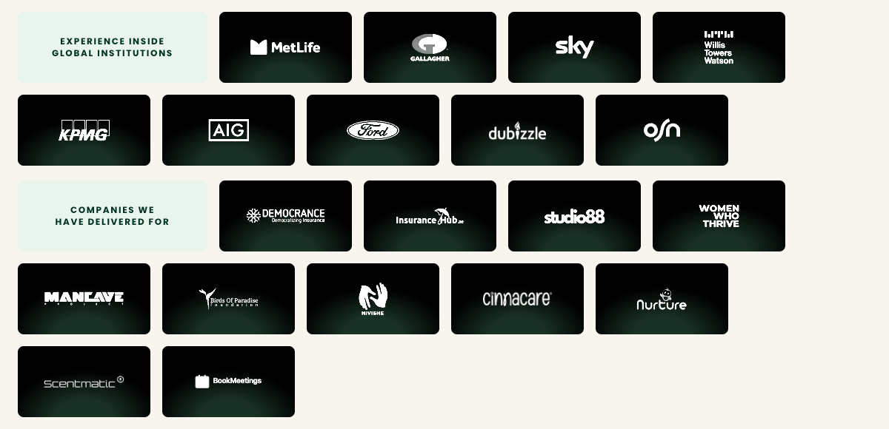
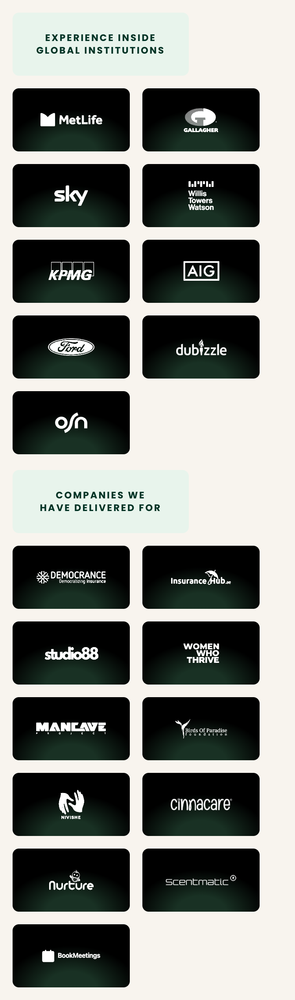
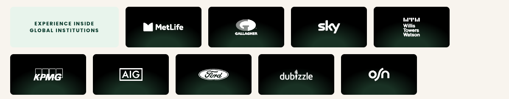
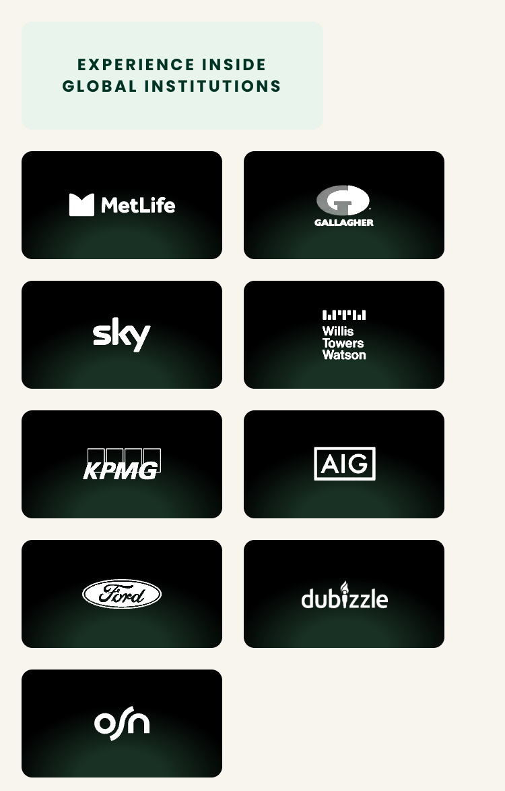
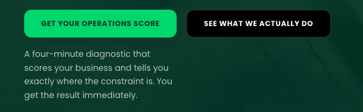
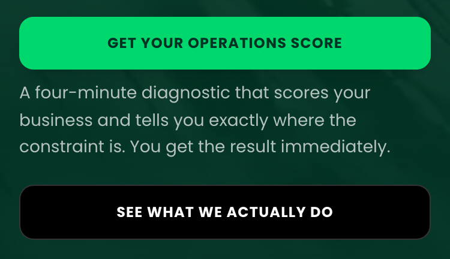

# Your website comments, checked against the live site

**3 October 2026** · https://pivotprime.ae

**Your requests: 40.** Done: 39. Done with a note: 0. Open: 1. (Your 30 September deck: 37, of which 36 done and 1 open. Your comments of 3 October: 3, all done.)

Every request in your 30 September deck and your three comments of 3 October was checked on the live site, on a computer and on a phone, and then checked again by a second, independent review.

39 of the 40 are done, and one is open: the email to subscribers when an article is published, which is a new feature that has not been built.

Your earlier decks were checked as well: nothing they asked for has been undone, and 6 earlier requests were put right during this check.

Each request quotes your own words. Where your slide showed what you wanted, your picture is on the left and the live site on the right.

**Done** means the live site matches your words. **Done with a note** means it is done and a difference remains, set out under it. **Open** means it is not finished yet; what each needs is listed at the end.

The document with every version of the diagnostic advice, one for each of the six areas, goes to you with this report.

## Slide 1: The logos

### 1.1 · Done

> The institutions strip still shows MetLife, Gallagher, Sky, Willis Towers Watson, KPMG and AIG. Ford, Dubizzle and OSN are missing.

**What was done:** Ford, dubizzle and OSN are in the "Experience inside global institutions" row after AIG, in the order your slide names them, and all six earlier logos are still there. Every logo in the row is now white on the same dark rounded tile with the same faint green glow, sized to match the others, so Ford is a white oval and AIG is about one and a half times its old width, and when a phone or computer is set to reduce movement the row stands still and wraps so every logo shows.

**Whose instruction:** Every logo is white and sized to match the others, as your note of 3 October asked, and the row sits within the page's content width, as your slide 11 asked.

**Live page:** https://pivotprime.ae/

*On a computer: img/1-1.png*

*On a phone: img/1-1-375.png*

### 1.2 · Done

> The "Companies we have delivered for" strip has none of Cinnacare, Nurture UAE, Scentmatic or BookMeetings yet.

**What was done:** Cinnacare, Nurture UAE, Scentmatic and BookMeetings are in the "Companies we have delivered for" row after Nivishe, in the order your slide names them, and none of the existing companies has gone. Every logo in the row is now white on the same dark rounded tile with the same faint green glow, sized to match the others, so Nurture shows as a white name with its owl instead of its purple icon, and when a phone or computer is set to reduce movement the row stands still and wraps so every logo shows.

**Whose instruction:** Every logo is white and sized to match the others, as your note of 3 October asked, and the row sits within the page's content width, as your slide 11 asked.

**Live page:** https://pivotprime.ae/

*On a computer: img/1-2.png*

*On a phone: img/1-2-375.png*

## Slide 2: The services section

### 2.1 · Done

> [1] Have refined it so it reads as 3 cards under diagnose, lead and build.

**What was done:** The services section on the homepage and on the Services page shows three cards headed "WE DIAGNOSE", "WE LEAD" and "WE BUILD", each label a full-width pale green bar with heavier dark lettering above your titles in green, with your rounded corners and, on a computer, the We Lead title breaking after "Chief of" as yours does. The cards now carry the faint shadow of your page, so the gaps between them stay the colour of the page, and they sit side by side at equal widths on a computer and stack in the same order on a phone.

**Whose instruction:** On the homepage the cards are a little narrower than in your picture because every section there now shares one width, as your slide 11 asked, and the colours, including the thin line round each card, are the site's own, which Saif keeps the same across the site.

**Live page:** https://pivotprime.ae/#services

*Your slide and the live site: img/2-1-compare.png*

*On a computer: img/2-1.png*

*On a phone: img/2-1-375.png*

### 2.2 · Done

> And only 3 offers now, see the html for this here - https://claude.ai/code/artifact/eeb21f42-35a9-4dce-ac61-a9c22f2faa19

**What was done:** Build and Place is a short note in the We Lead card and UAE market entry a sentence in the We Diagnose card's note, both worded as in your picture, so the section shows only three offers, with a price on the audit only, the thin lines where yours are, your line spacing, and arrows after the links that match those on the page your note links to. The dark panel beneath has your margins, your smaller label, your heavier heading and your narrower, smaller text, so it stands as tall as yours, and its button has the arrow.

**Whose instruction:** The panel keeps the wording of the page your note links to, its button stays rectangular as your 26 September note asked, it shares the homepage's one width from your slide 11, and its colours are the site's own, which Saif keeps the same across the site.

**Live page:** https://pivotprime.ae/#services

*Your slide and the live site: img/2-2-compare.png*

*On a computer: img/2-2.png*

*On a phone: img/2-2-375.png*

### 2.3 · Done

> The Services page still says "which of the five you actually need". Change it to three.

**What was done:** The Services page no longer says "five" anywhere: it shows the same three cards and diagnostic panel as the homepage, and the line under its heading begins "Three services, used on their own or together." The short description search engines show for the page names your three services instead of the five old ones.

**Whose instruction:** The sentence was in the old sixth card, which your diagnostic panel replaced, so following your design it has gone with that card rather than being reworded.

**Live page:** https://pivotprime.ae/services

*On a computer: img/2-3.png*

*On a phone: img/2-3-375.png*

## Slide 3: Meet the CEO & Founder

### 3.1 · Done

> [1] Eyebrow heading - Meet the CEO & Founder

**What was done:** Your eyebrow heading, "MEET THE CEO & FOUNDER", sits in small green capitals just above the main heading of the founder section on the homepage, on a computer and on a phone. It has the letter spacing of your picture, and on a computer the space under it is also as in your picture.

**Whose instruction:** The words follow your written note rather than the "Our CEO and Founder" in your picture, and the green and the cream behind it are the site's own colours, which Saif keeps across the whole site.

**Live page:** https://pivotprime.ae/

*Your slide and the live site: img/3-1-compare.png*

*On a computer: img/3-1.png*

*On a phone: img/3-1-375.png*

### 3.2 · Done

> then as per second pic here

**What was done:** The section now follows your second picture: your eyebrow heading, your main heading in the same heavier lettering with its lines as close together as yours, your two paragraphs with your more open line spacing, then a "MEET THE FULL TEAM" button the size of yours, in your heavier lettering with your long thin arrow one space after the words and no shadow, which opens the team section of the About page. Your photo stays on the right on a computer and above the text on a phone.

**Whose instruction:** The button stays rectangular as your note on this slide asks, your first paragraph runs one line longer because it sits beside your photo within the single width your slide 11 asked for, and the colours are the site's own, which Saif keeps across the whole site.

**Live page:** https://pivotprime.ae/

*Your slide and the live site: img/3-2-compare.png*

*On a computer: img/3-2.png*

*On a phone: img/3-2-375.png*

### 3.3 · Done

> but keep my photo of course

**What was done:** Your photograph is kept, the same picture with the same framing. On a computer it sits to the right of the new text, and on a phone it sits above it, with your head fully in the frame.

**Live page:** https://pivotprime.ae/

*Your slide and the live site: img/3-3-compare.png*

*On a computer: img/3-3.png*

*On a phone: img/3-3-375.png*

### 3.4 · Done

> [2] – Use right hand side text and heading please.

**What was done:** The old heading about the mathematician and both old paragraphs are gone from the homepage. Your heading and two paragraphs from the right-hand picture are in place word for word, with "$120 million" written out in full, on a computer and on a phone.

**Live page:** https://pivotprime.ae/

*Your slide and the live site: img/3-4-compare.png*

*On a computer: img/3-4.png*

*On a phone: img/3-4-375.png*

### 3.5 · Done

> [3) reminder buttons to remain rectangular as currently is

**What was done:** The button in this section keeps its rectangular shape with small rounded corners, and so does the "TALK TO US" button in the top bar and in the menu on a phone. None of the homepage buttons has become a pill shape.

**Whose instruction:** Only its rectangular shape is kept from your first picture, as your note asks: its words, heavier lettering, size, long thin arrow and lack of a shadow now follow your second picture.

**Live page:** https://pivotprime.ae/

*Your slide and the live site: img/3-5-compare.png*

*On a computer: img/3-5.png*

*On a phone: img/3-5-375.png*

## Slide 4: Your biography and LinkedIn

### 4.1 · Done

> [1] Below add my linked in page, and say connect with Iram on Linkedin

**What was done:** Your card on the About page has a green "Connect with Iram on LinkedIn" button under your biography and tags, the same size and style as the team's buttons in your team file. It opens your LinkedIn profile in a new tab, on a computer and on a phone, where its words run onto two lines to fit the card.

**Whose instruction:** The button goes to the LinkedIn address Saif supplied for you, because your slides and your team file do not give one.

**Live page:** https://pivotprime.ae/about#team

*On a computer: img/4-1.png*

*On a phone: img/4-1-375.png*

### 4.2 · Done

> do this for all staff.

**What was done:** Justin, Nisha, Saif and Khushi each have the same green "Connect with ... on LinkedIn" button under their biography and tags, and each opens that person's own LinkedIn profile from your team file in a new tab. On a computer Justin's and Nisha's buttons run onto two lines, as in your team file, and on a phone every button fits inside its card on two lines.

**Live page:** https://pivotprime.ae/about#team

*On a computer: img/4-2.png*

*On a phone: img/4-2-375.png*

### 4.3 · Done

> [2] Under the heading of my name, the text will be:
> Iram has held the roles that Pivot Prime now provides for its clients.
> Chief of Staff to the CEO of AIG GCCNA. Head of Operations at Gallagher's Middle East brokerage, with full accountability for compliance, finance, IT, HR, claims and offshore delivery. Head of Pricing and Portfolio Management for a $120M book spanning the Middle East, Africa and Israel. She has not studied these functions from the outside. She has run them.
> Over sixteen years at AIG, MetLife and Gallagher, she built operating models from scratch, led enterprise transformation aligned with DFSA standards, scaled delivery capability across borders, and closed major commercial partnerships in the region. She has been based in Dubai for ten years and understands the market the way only someone who has operated inside it does.
> She is a Fellow of the Institute and Faculty of Actuaries,and holds an MSc in Mathematics with Distinction from the University of Birmingham.
> She founded Pivot Prime on one conviction: the people best placed to fix a business are those who have run one.

**What was done:** Your new biography sits directly under your name on the About page, in five paragraphs, in your order and word for word as you wrote it, and the old wording is gone. On a phone your photograph sits above the text.

**Whose instruction:** The only change to your text is a space added after the comma in "Actuaries, and", where your slide has none.

**Live page:** https://pivotprime.ae/about#team

*On a computer: img/4-3.png*

*On a phone: img/4-3-375.png*

### 4.4 · Done

> Tags: Fellow, IFoA · Gallagher · AIG · MetLife · UK · Middle East · Africa · 16 years senior leadership.

**What was done:** The tags under your biography read exactly as your line, in your order, as eight tags from "Fellow, IFoA" to "16 years senior leadership", with Gallagher before AIG and MetLife. The old grouped tags are gone, and on a phone they wrap onto three rows inside your card.

**Whose instruction:** The tags are drawn as outlines, at the size in the team file you sent with your next slide, so they match the tags on the rest of the team.

**Live page:** https://pivotprime.ae/about#team

*On a computer: img/4-4.png*

*On a phone: img/4-4-375.png*

## Slide 5: The team

### 5.1 · Done

> We have to add Nisha to the website – her bio and details are attached

**What was done:** Nisha is on the About page, second in the row between Justin and Saif, with her job title, biography, tags and photograph as in your file and her photograph framed as in your picture. Her card no longer has a thin dark edge, so her photograph runs right to the edge of the card, and her tags sit a little further below her biography, as in your file.

**Live page:** https://pivotprime.ae/about#team

*Your slide and the live site: img/5-1-compare.png*

*On a computer: img/5-1.png*

*On a phone: img/5-1-375.png*

### 5.2 · Done

> Everyones bio sections to be updated a bit see attached html

**What was done:** Every biography, job title and tag reads exactly as in your file, in your layout of three tall cards with Khushi's wide card beneath, with the names in your heavier lettering, the lettering sizes of your file and no card shadows. The thin dark line round each card is gone, so every photograph runs right to the edge of its card, and the tags sit a little further below each biography, as in your file.

**Whose instruction:** The cards keep the site's own dark green and Saif's photograph keeps the framing he chose, both on Saif's instruction.

**Live page:** https://pivotprime.ae/about#team

*Your slide and the live site: img/5-2-compare.png*

*On a computer: img/5-2.png*

*On a phone: img/5-2-375.png*

### 5.3 · Done

> Add everyone’s linked in to the bottom of their bios

**What was done:** Everyone on the team, including you, has a green 'Connect with [name] on LinkedIn' button at the foot of their biography that opens their LinkedIn page in a new tab, with the lettering size and spacing of your file. As in your own file, the labels on Justin's and Nisha's buttons run onto two lines on a computer, and on a phone Saif's label now fits on one line.

**Whose instruction:** Your own button opens the LinkedIn address Saif supplied, because your team file gives addresses for the other four people only.

**Live page:** https://pivotprime.ae/about#team

*Your slide and the live site: img/5-3-compare.png*

*On a computer: img/5-3.png*

*On a phone: img/5-3-375.png*

## Slide 6: The Nurture screenshot

### 6.1 · Done

> Still to do: the Nurture screenshot still says "Good morning, Test App". Replace it with a live screenshot showing a real name.

**What was done:** The Nurture card on the homepage and on the About page now shows a new screenshot taken from the app's home screen, greeting "Sarah" with her child "Layla" and the day's activities, meals, sleep and photos filled in, and "Test App" appears nowhere on it. Sarah and Layla are a made-up family entered only for this picture, so no real parent's or child's name or details are on the website.

**Live page:** https://pivotprime.ae/

*On a computer: img/6-1.png*

*On a phone: img/6-1-375.png*

## Slide 7: The diagnostic opening screen

### 7.1 · Done

> [1] FREE DIAGNOSTIC, SLIGHTLY BIGGER, OR HIGHLIGHTED,

**What was done:** The label now reads FREE DIAGNOSTIC without the old Pivot Prime in front. On a computer it is the size your picture shows, which is bigger than before and bigger than the small labels elsewhere on the site, and it sits on a pale green highlight.

**Whose instruction:** The pale green box behind the label follows your note asking for the label to be bigger or highlighted; your picture shows it without one.

**Live page:** https://pivotprime.ae/diagnostic

*Your slide and the live site: img/7-1-compare.png*

*On a computer: img/7-1.png*

*On a phone: img/7-1-375.png*

### 7.2 · Done

> [2] Main page to look like second pic shown here

**What was done:** The opening screen follows your second picture from top to bottom, centred, with every part from the label to the note under the button at the size and spacing your picture shows. The heading is now in the heaviest lettering and the button in the next heaviest, as in your picture.

**Whose instruction:** The rectangular button, the pale green box behind the label and the cream background follow your own notes on this slide, and the text and the button use the site's own colours closest to yours, which Saif keeps to, with the small line under the button a shade darker so it stays easy to read.

**Live page:** https://pivotprime.ae/diagnostic

*Your slide and the live site: img/7-2-compare.png*

*On a computer: img/7-2.png*

*On a phone: img/7-2-375.png*

### 7.3 · Done

> remove all the stretched founder stuff etc

**What was done:** The four reader cards, starting with "The stretched founder", are gone from the opening screen. The paragraph now leads straight into the four points and the start button, with the spacing your picture shows.

**Live page:** https://pivotprime.ae/diagnostic

*Your slide and the live site: img/7-3-compare.png*

*On a computer: img/7-3.png*

*On a phone: img/7-3-375.png*

### 7.4 · Done

> and have the lighter background similar to most of the website.

**What was done:** The dark green background is gone: the opening screen now sits on the same light cream as most of the website, under the usual top bar, with near-black and green text as in your picture.

**Whose instruction:** The cream is the background used across most of the website, as your note asked, so it is a touch warmer than the grey-white in your picture.

**Live page:** https://pivotprime.ae/diagnostic

*Your slide and the live site: img/7-4-compare.png*

*On a computer: img/7-4.png*

*On a phone: img/7-4-375.png*

### 7.5 · Done

> Keep wording as shown in this picture 

**What was done:** Every line on the opening screen uses the wording from your picture, including START THE DIAGNOSTIC with the arrow. On a computer the paragraph and the note also break onto new lines where yours do.

**Live page:** https://pivotprime.ae/diagnostic

*Your slide and the live site: img/7-5-compare.png*

*On a computer: img/7-5.png*

*On a phone: img/7-5-375.png*

### 7.6 · Done

> [3], start the diagnostic button to be rectangular like all other buttons and example shown below

**What was done:** The start button now has the same slightly rounded rectangular corners as the homepage button in your example and every other green button on the site, in the same bright green with dark capital lettering.

**Whose instruction:** It is larger than the button in your example, with larger and heavier lettering, because your note [2] asks for the page to look like your second picture, which draws it this way.

**Live page:** https://pivotprime.ae/diagnostic

*Your slide and the live site: img/7-6-compare.png*

*On a computer: img/7-6.png*

*On a phone: img/7-6-375.png*

## Slide 8: The diagnostic results

### 8.1 · Done

> [1] I have to read all the different versions of advice we give, can you share

**What was done:** Every version of the advice is in a separate document sent with this report. It quotes your slide 8 note exactly and covers all six areas, each checked word for word against what the live diagnostic shows once someone enters their email address.

**Live page:** https://pivotprime.ae/diagnostic

*On a computer: img/8-1.png*

### 8.2 · Done

> The data all shown here, it will all pop up on screen when they enter their email address in, and look basically like this - https://claude.ai/code/artifact/e38bc4c5-1a88-4015-bed0-0016d663ae84

**What was done:** Once someone fills in their details and presses "Unlock my score", your three sections appear on the same screen, on a computer and on a phone, in your order and word for word as in your pictures. None of them shows before that.

**Whose instruction:** The two buttons read "Book a call" and "Talk to us on WhatsApp" and are rectangular, following your later instructions rather than the round "Book a call with Iram" in your picture, and the greens are the site's own colours, following Saif's rule for the site's palette.

**Live page:** https://pivotprime.ae/diagnostic

*Your slide and the live site: img/8-2-compare.png*

*On a computer: img/8-2.png*

*On a phone: img/8-2-375.png*

### 8.3 · Done

> The "Unlock my score" button is still a round pill. Make it rectangular.

**What was done:** The "Unlock my score" button is rectangular, with the same small rounded corners as the site's other buttons, on a computer and on a phone, and it keeps that shape while it shows "Sending". Its wording and colours are unchanged.

**Live page:** https://pivotprime.ae/diagnostic

*On a computer: img/8-3.png*

*On a phone: img/8-3-375.png*

## Slide 9: The Insights sign-up

### 9.1 · Done

> [1] Fix this, it doesn’t work when we subscribe

**What was done:** The sign-up failed because it sent from an email address the mail service had not approved; it now uses the same approved address as the contact form, and a real sign-up made on the live site on 2 October, with an address clearly marked as a test, showed "You are on the list. The next piece comes to you." instead of the error in your picture. The site only shows that message once the mail service has accepted the notice to hello@pivotprime.ae, which carries the subject "Insights subscription: delivered+test-please-ignore@resend.dev"; we could not see that inbox ourselves to confirm it arrived.

**Live page:** https://pivotprime.ae/insights

*On a computer: img/9-1.png*

*On a phone: img/9-1-375.png*

### 9.2 · Done

> [2] fix the button here to be rectangular

**What was done:** The "Subscribe" button now has the same slightly rounded corners as the other buttons on the site instead of the full pill, on a computer and on a phone, and it keeps that shape while it shows "Sending". The email box beside it has the same corners, so the two match.

**Live page:** https://pivotprime.ae/insights

*On a computer: img/9-2.png*

*On a phone: img/9-2-375.png*

### 9.3 · Open

> When the next article is published, test that subscribers receive the email and that its link opens the article.

**What was done:** This test has not been run yet. Each sign-up sends the new subscriber a confirmation and sends a notice to the hello@pivotprime.ae inbox, but the site does not email subscribers when an article is published, because that is a new feature that has not been built.

**Still needed:** Emailing subscribers when an article is published is a new feature that has not been built. Once it is agreed and built, and the sign-ups so far are gathered from the notices in the hello@pivotprime.ae inbox, the test can be run on the next article.

**Live page:** https://pivotprime.ae/insights

*On a computer: img/9-3.png*

*On a phone: img/9-3-375.png*

## Slide 10: The September articles

### 10.1 · Done

> [1] Add the three articles shown below, for September – find full articles at –
> https://claude.ai/code/artifact/374a7554-969c-4e4f-bb74-a4056085bd13

**What was done:** The three September articles are on the Insights page after the August ones, in the order your picture shows, and each opens its own page with the full article from your link, word for word. All six cards follow the design in your picture, and the small arrow at the foot of each card is now drawn into the page at the size of the one in your picture, so every computer and phone shows the same slim arrow.

**Whose instruction:** The page behind the cards stays the site's own cream and the text and line colours are the nearest the site's colours allow, following Saif's rule that the site keeps to its own palette.

**Live page:** https://pivotprime.ae/insights

*Your slide and the live site: img/10-1-compare.png*

*On a computer: img/10-1.png*

*On a phone: img/10-1-375.png*

### 10.2 · Done

> fractional CFO (by Justin Ford)

**What was done:** The CFO article is credited to Justin Ford, with his initials, both on its card on the Insights page and on the article page itself, where his role, "Fractional CFO, Pivot Prime", sits under his name.

**Whose instruction:** This follows your slide 10 note and its picture, which name Justin, rather than the articles page you linked, which had it under your name.

**Live page:** https://pivotprime.ae/insights/fractional-cfo

*Your slide and the live site: img/10-2-compare.png*

*On a computer: img/10-2.png*

*On a phone: img/10-2-375.png*

## Slide 11: The homepage as one flow

### 11.1 · Done

> Please use one content width for every section, so all headings, cards and buttons start on the same left edge.

**What was done:** Every section of the homepage now uses one width, so headings, cards and buttons start on the same left edge, and every section stays within the same right edge, from the top of the page down to the closing box, on a computer and on a phone, including the places your red lines marked. Inside the three white boxes, the text and buttons start on one shared inner edge.

**Whose instruction:** The closing box keeps its centred layout, as in your 26 September picture of it, and on a computer the TAKE THE DIAGNOSTIC button stays on the right of the "Start with the diagnostic" panel, as in your slide 2 picture of that panel.

**Live page:** https://pivotprime.ae/

*On a computer: img/11-1.png*

*On a phone: img/11-1-375.png*

### 11.2 · Done

> Use the same spacing between every section

**What was done:** The space under the large photograph at the top of the homepage, and on a phone the space under the small dots beneath the results, now match every other gap, so all nine gaps between sections are the same, including the three you marked. This holds on a computer and on a phone, whether or not the phone is set to reduce movement.

**Live page:** https://pivotprime.ae/

*On a computer: img/11-2.png*

*On a phone: img/11-2-375.png*

### 11.3 · Done

> remove the thin divider line above Who we serve.

**What was done:** The thin line above Who we serve has gone, on a computer and on a phone. Between the Talk to us button and WHO WE SERVE there is now only the page background, apart from the button's own soft shadow, which fades away just below the button.

**Live page:** https://pivotprime.ae/

*On a computer: img/11-3.png*

*On a phone: img/11-3-375.png*

### 11.4 · Done

> Use one background colour for boxed sections.

**What was done:** The Who we serve, case studies and Our fees boxes are all the same pure white on a computer and on a phone, and none of the three has a shadow any more.

**Whose instruction:** The closing box stays dark green, as in your 26 September picture of it.

**Live page:** https://pivotprime.ae/

*On a computer: img/11-4.png*

*On a phone: img/11-4-375.png*

### 11.5 · Done

> remove the band.

**What was done:** The grey band under the case studies box has gone: under the box and beside it there is only the plain page background, on a computer and on a phone.

**Live page:** https://pivotprime.ae/

*On a computer: img/11-5.png*

*On a phone: img/11-5-375.png*

## Your comments of 3 October

Three comments you sent from your phone on 3 October, each checked on the live site on a phone.

### Comment 1 · Done

> Make the logos same treatment sir u cant have it messy like this some colour and not

**What was done:** Every logo in both rows is now white on the same dark tile with the same faint green glow at its foot, including Ford, now a white oval with its name showing dark through it, and Nurture UAE, now a white name and bird with no coloured badge. Gallagher keeps the grey half of its own emblem that forms its G, and the rows look the same whether they are moving or, for visitors who ask for less movement, standing still.

**Live page:** https://pivotprime.ae/

*On a computer: img/oct3-1.png*

*On a phone: img/oct3-1-375.png*

### Comment 2 · Done

> When fixing logos please make all same size also the AIG became so small now?

**What was done:** Every logo is now sized from the logo itself, so each one fits the same space in its tile and covers about the same area, whether it is a long name or a compact emblem. AIG had not shrunk (its logo had always filled less of its own picture than any other), and it is now about one and a half times its old width and about the same height as KPMG beside it.

**Live page:** https://pivotprime.ae/

*On a computer: img/oct3-2.png*

*On a phone: img/oct3-2-375.png*

### Comment 3 · Done

> On the mobile this is still coming under both buttons so not clear but on desktop its fine - can we do anything for mobile

*You circled, on your phone, the line "A four-minute diagnostic that scores your business and tells you exactly where the constraint is. You get the result immediately." sitting under both buttons at the top of the homepage.*

**What was done:** On a phone, the line about the four-minute diagnostic now sits directly under GET YOUR OPERATIONS SCORE, close to it, with more space before SEE WHAT WE ACTUALLY DO, so it reads as belonging to the first button. On a computer nothing has changed: the two buttons sit side by side with the line under the first one.

**Live page:** https://pivotprime.ae/

*On a computer: img/oct3-3.png*

*On a phone: img/oct3-3-375.png*

## Your earlier comments

Your 23 August and 26 September decks were checked to make sure nothing they asked for has since been undone. Of the 86 earlier requests your 30 September deck did not change, 74 are in place, 6 were put right during this check, 3 were changed by your later instructions and 3 are still to do.

### Put right in this check

- **23 August deck, slide 2:** Stop centring the "As featured in" line so it matches the sections below. The "As featured in" line now starts on the same left edge as the headings below it, on a computer and on a phone, instead of sitting in the centre.
- **23 August deck, slide 3:** Change the results line to "we measure what has changed". The line under the results heading now reads exactly "We do not measure success in slide decks, we measure what has changed."
- **23 August deck, slide 14:** Remove the text under the seats diagram. The line of text under the Build and Place seats diagram is gone, so the diagram ends with the six seats on a computer and on a phone.
- **23 August deck, slide 16:** Change the heading to say you are not interested in launching a business in the UAE which will fail. The heading in the Straight answer panel on the UAE Market Entry page reads, word for word, "We are not interested in launching a business in the UAE which will fail."
- **23 August deck, slide 16:** Use your "If after assessment" line under that heading. The line under that heading reads your sentence word for word, starting "If after assessment, we feel your business will fail here", on a computer and on a phone.
- **23 August deck, slide 21:** Follow the About page HTML you emailed. The About page follows your emailed design, and The Bench now shows your five chosen capabilities in green, with the capital M back in "Project Management". The case studies section and team cards follow your later instructions instead, and the other capabilities on The Bench are slightly brighter than in your file.

*23 August deck, slide 2: img/r-aug23a-10.png*

*23 August deck, slide 3: img/r-aug23a-12.png*

*23 August deck, slide 14: img/r-aug23b-10.png*

*23 August deck, slide 16: img/r-aug23b-12.png*

*23 August deck, slide 16: img/r-aug23b-13.png*

*23 August deck, slide 21: img/r-aug23c-12.png*

### Still to do

- **23 August deck, slide 1:** Use a video at the top of the homepage. The top of the homepage still shows a slowly drifting photograph rather than a video, because no video has been supplied.
- **23 August deck, slide 1:** Reword the second button at the top of the homepage along the lines of "find out what we actually do". That button still reads "SEE WHAT WE ACTUALLY DO" and takes people to the services section, because your note offered more than one possible wording.
- **23 August deck, slide 15:** Keep the top of the Technology Builds page and add a showcase of Saif's work. The top of the Technology Builds page is back, with the green "Builds." and "Own it outright, or we maintain it" beside the price, but there is still no showcase of Saif's work: no project is named and the page has no pictures.

*23 August deck, slide 1: img/r-aug23a-4.png*

*23 August deck, slide 1: img/r-aug23a-8.png*

*23 August deck, slide 15: img/r-aug23b-11.png*

### Changed by your later instruction

- **23 August deck, slide 1:** Use the proper Pivot Prime logo. The top bar, the foot of every page and the browser tab all show the logo you confirmed as correct on 1 September. The logo files from your 11 August email were not used.
- **23 August deck, slide 20:** Retitle P&L card 1. P&L card 1 carries your new title and subtitle, with the long dash in the subtitle replaced by a comma, as you later asked for the whole site.
- **23 August deck, slide 20:** Retitle P&L card 3. P&L card 3 carries your new title and subtitle, with the long dash replaced by a comma, as you later asked for the whole site.

### In place

- **26 September deck, slide 1:** Rename the first button at the top of the homepage to "Get your operations score". The first homepage button reads "GET YOUR OPERATIONS SCORE" and takes people to the diagnostic, on a computer and on a phone.
- **26 September deck, slide 1:** Put the grey line under the first button only, not across both. On a computer the grey line sits only under the first button, with the two buttons close together; on a phone the buttons stack and the line sits under both, which was our choice so the pair stays together.
- **26 September deck, slide 1:** Change the grey line to your new diagnostic sentence. The grey line under the two buttons at the top of the homepage reads your sentence word for word, and the old wording is gone.
- **26 September deck, slide 1:** Remove the "Trusted by SMEs" sentence. The "Trusted by SMEs" sentence is gone from the homepage, while the "As featured in" line and both logo rows remain.
- **26 September deck, slide 2:** Reorder the homepage sections to your list. The homepage sections run in your order on a computer and on a phone, and the Our fees section, which your list did not include, has been kept just before the closing box.
- **26 September deck, slide 3:** Make the results cards move on by themselves on a computer. On a computer the results cards move on by themselves every six seconds, even with the mouse resting on them, and the arrows and dots work.
- **26 September deck, slide 3:** Slow the results cards down on a phone. On a phone the results cards change every six seconds instead of every three, and tapping a dot does not stop them.
- **26 September deck, slide 4:** Make all buttons rectangular, including "Take the diagnostic". The "TAKE THE DIAGNOSTIC" button, on the homepage and the Services page, and every other button on the homepage have the same small rounded corners as your example, and only the ten buttons in the list of symptoms are a little rounder, though still not pill-shaped.
- **26 September deck, slide 5:** Move the patterns section higher up the homepage. The patterns section is the third section on the homepage, straight after the logos.
- **26 September deck, slide 5:** Put the green "Select the symptoms" bar first, under the big heading. The green "Select the symptoms" bar sits straight under the heading and above all ten symptoms, and choosing symptoms updates it and carries them into the contact form.
- **26 September deck, slide 5:** Change the bar wording to tell people to tap any blockers below. The bar reads "Select the symptoms that sound familiar", then "Tap any blockers below to see how we structure the fix", with "below" in lower case because it falls mid-sentence.
- **26 September deck, slide 8:** Put the results before the "View the product" links. On the homepage and the About page, the results come before the "View the product" and "Visit the site" buttons on the Nurture, Cinnacare and Scentmatic case studies.
- **26 September deck, slide 9:** Fix the size of the closing box and its heading. The closing box is the same width as the rest of the page, and its heading is now the same size as the other main section headings.
- **26 September deck, slide 9:** Change the closing heading to "Find out what is holding your business back". The closing heading reads "Find out what is holding your business back."
- **26 September deck, slide 9:** Change the closing subtext to your diagnostic and WhatsApp sentence. The line under the closing heading reads your sentence word for word, and the old "Two ways to start" text is gone.
- **26 September deck, slide 9:** Label the closing buttons "Take the diagnostic" and "Talk to us". The closing buttons read "TAKE THE DIAGNOSTIC" and "TALK TO US", and open the diagnostic and WhatsApp.
- **26 September deck, slide 10:** Remove Build and Place and UAE Market Entry from the Services menu. The Services menu lists only "All Services", "Operational Clarity Audit", "Fractional Leadership" and "Technology Builds", on a computer and on a phone.
- **26 September deck, slide 10:** Keep those two pages live for search and direct visits. The Build and Place and UAE Market Entry pages are still live, open directly and remain listed for search engines.
- **26 September deck, slide 10:** Link to those two pages from other pages. The Operational Clarity Audit page links to UAE Market Entry, and the Fractional Leadership page links to Build and Place. Build and Place is also linked from the service buttons on the For Founders and For Corporate Innovators pages. The Services page no longer links to either, because it shows just your three offers.
- **26 September deck, slide 11:** Add the UAE Market Entry section to the audit page. The UAE Market Entry section sits after "How we do it" and "What happens after" on the audit page, with your wording and a working link, though its heading is not in capitals, in line with your earlier rule for headings on the service pages.
- **26 September deck, slide 12:** Add the "Need other staff" section to the Fractional Leadership page. Your heading and paragraph are on the Fractional Leadership page word for word, straight after "Where it does not fit" and "How it runs", with only the first letter of the heading in capitals, like its neighbours, rather than all in capitals as you typed it.
- **26 September deck, slide 12:** Add a "Find out more about Build and Place" link. The "Find out more about Build and Place" button sits in that section, opens that service's page and has the site's small rounded corners.
- **26 September deck, slide 13:** Capitalise the Who it's for menu items. The Who it's for menu reads "For Founders", "For SMEs", "For Corporate Innovators" and "For P&L owners" on a computer and on a phone, and all four pages open.
- **26 September deck, slide 14:** Remove the long dashes from the articles and the whole site. There are no long dashes anywhere on the live site, including the articles and every diagnostic screen. The only dashes left are short ones in seven number ranges, such as ranges of months or weeks, kept on purpose.
- **26 September deck, slide 14:** Reword the sentence in the "consultant leaves" article. The "consultant leaves" article reads "Building these things requires someone in the room, not quarterly, not monthly", with your commas in place of the dash.
- **26 September deck, slide 15:** Change "Book a call with Iram" to just "Book a call". Where an article offers a call, its closing button now says just "Book a call" and opens the contact page, and "Book a call with Iram" appears nowhere on the site.
- **26 September deck, slide 15:** Match the article button's corners to the rest of the site. The closing buttons on all seven articles have the same small rounded corners as the homepage button you showed, not a pill shape.
- **26 September deck, slide 16:** Spell check all the articles. A British English spell check of all seven live articles and the Insights page found no spelling mistakes.
- **26 September deck, slide 16:** Fix the first sentence of the decisions article. The first sentence of the decisions article shows P&L correctly, with "organisation" spelt the British way with an s, as on the rest of the site, rather than with the z you typed.
- **26 September deck, slide 18:** Show only the blurred results and the form before people unlock them. After the last question the diagnostic shows only the blurred score, the blurred area breakdown and the details form. Its heading reads "Unlock your score and get the full report" and its button reads "Unlock my score", rather than the wording in your picture.
- **26 September deck, slide 18:** Make the diagnostic buttons rectangular. Every button in the diagnostic, including "Start the diagnostic", "Next", "See my results" and "Unlock my score", has the site's small rounded corners, and "Back" is plain text with no box.
- **26 September deck, slide 22:** Make the Insights closing button rectangular. The button in the Insights closing box has the site's small rounded corners, not a pill shape.
- **26 September deck, slide 22:** Make the Insights button just say "Book a call". The Insights closing button says just "Book a call" and opens the contact page.
- **23 August deck, slide 1:** Try the top bar in different colours to compare. The top bar was set to one solid dark green on 27 August, and our August review of your comments records the colour trial as done. It is that same dark green on a computer and on a phone.
- **23 August deck, slide 1:** Give the top bar small rounded corners so it is more rectangular. The top bar has small rounded corners and reads as a rectangle on a computer and on a phone, including with the phone menu open.
- **23 August deck, slide 1:** Put Strategy, Operations, Technology, Execution at the top. The line above the headline names Strategy, Operations, Technology and Execution in your order, on one line on a computer and on two lines on a phone.
- **23 August deck, slide 1:** Set the "Most consultants" line apart with a different font or italics. The "Most consultants recommend the fix" line and the green, underlined line after it are both in italics, so they stand apart from the heading and paragraph around them.
- **23 August deck, slide 1:** Cut the paragraph at the top of the homepage down to the sentence about finding what is holding your business back. The paragraph under the headline is now only that sentence, and it begins "We find what is holding", without the word "out" from your note.
- **23 August deck, slide 2:** Improve the logo rows with proper logos. The logo rows use proper logo files, with the two group names shown as plain text tiles, and the two rows scroll in opposite directions. Every tile, old and new, now carries the same faint green glow at its foot, and the Ford and Nurture logos keep their own colours.
- **23 August deck, slide 3:** Give each results figure its own visual style. Each of the five results cards has its own drawing, so no two look alike, and the old rotating ring chart is gone.
- **23 August deck, slide 3:** Try warmer colour options, using the ivory instead of cold white. The pages sit on a warm cream instead of cold white, mixed from your ivory and linen rather than the ivory alone, with no gold or tan. White is used only inside boxes and cards, such as those described under 11.4, never for a whole section.
- **23 August deck, slide 3:** Make the results cards from the HTML you sent. The five results cards follow your HTML file with your figures and drawings, one reads "Increase in profit" rather than your picture's "Increase in profit margin", and the short line under each figure is back because your file includes it.
- **23 August deck, slide 6:** Remove the "Knowing what is wrong is hard" section. The "Knowing what is wrong is hard" section and its four step cards are gone from the homepage.
- **23 August deck, slide 8:** Replace "Chapter 2" with "Case studies". The section is headed "CASE STUDIES", and no chapter number appears on any of the main pages.
- **23 August deck, slide 8:** Use the photos you emailed for case studies 1 and 2. Cinnacare shows your photo of the two baby oil bottles and Scentmatic shows the vending machine on the bar, on the homepage and the About page, both fully in frame.
- **23 August deck, slide 8:** Use your new quote in the case studies section. Your quote appears in the case studies section word for word, credited to you as "Founder and CEO", with a straight apostrophe rather than a curly one in "it's".
- **23 August deck, slide 8:** Move the anonymised case studies to About and add a "More case studies" button. The homepage shows only Nurture, Cinnacare and Scentmatic, and a "MORE CASE STUDIES" button, on the same left edge as the headings, takes people to the case studies on the About page.
- **23 August deck, slide 8:** Use your text for the second anonymised case study. The Founder-led business case study on the About page uses your text word for word.
- **23 August deck, slide 8:** Use your text for the third anonymised case study. The Fitness and wellness case study on the About page uses your text word for word.
- **23 August deck, slide 8:** Show at least one of Saif's projects as a case study. Saif's Nurture app is the first case study on the homepage and the About page, with a note that our technology team made it.
- **23 August deck, slide 8:** Keep the anonymised case studies only on About, with a link to them. The anonymised case studies appear only on the About page, and the homepage links to them.
- **23 August deck, slide 9:** Head the section "WHO WE SERVE", with no chapter number. The section is headed "WHO WE SERVE", with no chapter number.
- **23 August deck, slide 9:** Order the readers: founder, SME, corporate innovator, then the mid-market owner. The Who we serve tabs and the Who it's for menu run founder, SME, corporate innovator, then P&L owner, with the founder tab open first.
- **23 August deck, slide 9:** Rename the mid-market reader to "P&L owner". The mid-market reader is now called "P&L owner" on the homepage, in the menu and on its own page, and the old mid-market wording is gone.
- **23 August deck, slide 9:** Change Riyadh to Qatar in the corporate innovator quote. The corporate innovator quote is credited to a regional retail group in Qatar, and Riyadh appears on none of the main pages.
- **23 August deck, slide 9:** Put the quote boxes in the lighter green. The quote boxes on all four Who we serve tabs are light green on a white panel.
- **23 August deck, slide 10:** Change the fees label to just "OUR FEES". The fees section label reads "OUR FEES", with no chapter number, on a computer and on a phone.
- **23 August deck, slide 10:** Use larger quote boxes in the fees section. The small fees tag has been replaced by one large, full-width dark green box headed "Performance linked fees", though there is one box rather than several and its sentence is at normal text size rather than headline size as in your fees pictures.
- **23 August deck, slide 12:** Show a "What you get" panel with a shaded right side on every service page. Every service page has a two-box panel with a plain white left side and a dark green right side, though only the audit page's panel is headed "What you get".
- **23 August deck, slide 13:** Rename Fractional COO to Fractional Leadership in the menu. The Services menu says "Fractional Leadership", and the old Fractional COO link still works and leads to that page, while the service card on the homepage and Services page still reads "Fractional COO, CFO and Chief of Staff", which you did not ask to change.
- **23 August deck, slide 13:** Use your revised graphic on the Fractional Leadership page. The Fractional Leadership page shows the three phase cards from your 22 August service pages file in place of the old curve, with no monthly cost line.
- **23 August deck, slide 14:** Remove "Watch the seats fill". "Watch the seats fill" is gone from the Build and Place page.
- **23 August deck, slide 14:** Add Fractional COO to the seats diagram. Fractional COO appears on the Build and Place diagram as a sixth seat, and nothing overlaps on a computer or on a phone.
- **23 August deck, slide 14:** Write "Project Manager" with a capital M. The seat reads "Project Manager" with a capital M.
- **23 August deck, slide 14:** Change "Engineer" to "Software Engineer". The seat reads "Software Engineer" instead of "Engineer".
- **23 August deck, slide 17:** Hide the How We Work page but keep its wording. The How We Work page is still hidden, off the menus and out of search listings, and its wording is saved. The one exception is your green line under its heading, "It's about doing what works", which was replaced by a line we wrote before the page was hidden; your original line is kept only in our records.
- **23 August deck, slide 18:** Change the eyebrow heading to "FOR FOUNDERS". The small heading on the For Founders page reads "FOR FOUNDERS" with no chapter number, and the other three reader pages follow the same pattern, with the corporate page reading "FOR CORPORATE LEADERS" while its menu label says "For Corporate Innovators".
- **23 August deck, slide 18:** Keep only the heading, subheading and box on each For Founders card. Each For Founders card shows only its heading, its green line and its box, plus the service button added later.
- **23 August deck, slide 18:** Do the same on the For SMEs page. Each For SMEs card is cut back to its heading, green line and box, plus its service button, the same as For Founders.
- **23 August deck, slide 19:** Title the last corporate card "Senior judgment, on call". The last corporate card is titled "Senior judgment, on call", exactly as you wrote it.
- **23 August deck, slide 19:** Use your new subtitle on the last corporate card. The green line under that card reads your words exactly, starting "Through Fractional Leadership Services."
- **23 August deck, slide 19:** Put your monthly or ad hoc wording in the side box. The side box on that card says the typical engagement is monthly or ad hoc and that it is like having an Executive Board you can consult when you need.
- **23 August deck, slide 20:** Use P&L owners on the homepage too. The homepage calls the fourth reader "P&L owner", in the singular like the other three tabs, the menu says "For P&L owners", and the old mid-market wording is gone from every page.
- **23 August deck, slide 20:** Retitle P&L card 2. P&L card 2 carries your new title and subtitle word for word.

## Still open, and what each needs

- **Slide 9:** Emailing subscribers when an article is published is a new feature that has not been built. Once it is agreed and built, and the sign-ups so far are gathered from the notices in the hello@pivotprime.ae inbox, the test can be run on the next article.
- **23 August deck, slide 1:** From you: a video for the top of the homepage, which you have the rights to use.
- **23 August deck, slide 1:** The exact words for the second button at the top of the homepage, from you. Until then it keeps "SEE WHAT WE ACTUALLY DO".
- **23 August deck, slide 15:** From Saif: the list of projects to show, a screenshot or picture of each with client details blurred, and which client names can be shown. His profile on the About page already names four of his projects, but there are no pictures yet.
