# Your website comments, checked against the live site

**2 October 2026** · https://pivotprime.ae

**Your requests: 37.** Done: 16. Done with a note: 19. Open: 2.

Every request in your 30 September deck was checked on the live site, on a computer and on a phone, and then checked again by a second, independent review. Each request below quotes your own words. Where your slide showed what you wanted, your picture is on the left and the live site is on the right.

**Done** means the live site matches your words. **Done with a note** means it is done and there is something you should know, set out under it. **Open** means it is not finished yet; what each needs is listed at the end.

The document with every version of the diagnostic advice, one for each of the six areas, goes to you with this report.

## Slide 1

### 1.1 · Done with a note

> The institutions strip still shows MetLife, Gallagher, Sky, Willis Towers Watson, KPMG and AIG. Ford, Dubizzle and OSN are missing.

**What was done:** Ford, OSN and dubizzle are now in the "Experience inside global institutions" row after AIG, on dark rounded tiles the same size as the others, with all six earlier logos still there and Ford in its own navy oval with white lettering, because showing it in white like the other logos would leave a blank oval. For visitors who have set their phone or computer to reduce movement, the row stands still and wraps onto extra lines so that every logo shows.

**Note:** The three new tiles are a plain near-black and do not have the faint green glow at the foot of the older tiles, so side by side they look slightly greyer and plainer. The order is Ford, OSN, dubizzle, where your list said Ford, Dubizzle, OSN.

**Live page:** https://pivotprime.ae/

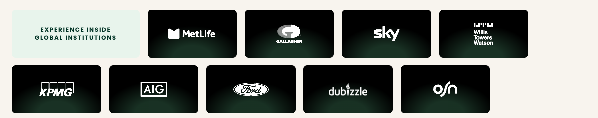
*On a computer, shown with movement turned off, so every logo is in view at once; otherwise the row scrolls: img/1-1.png*

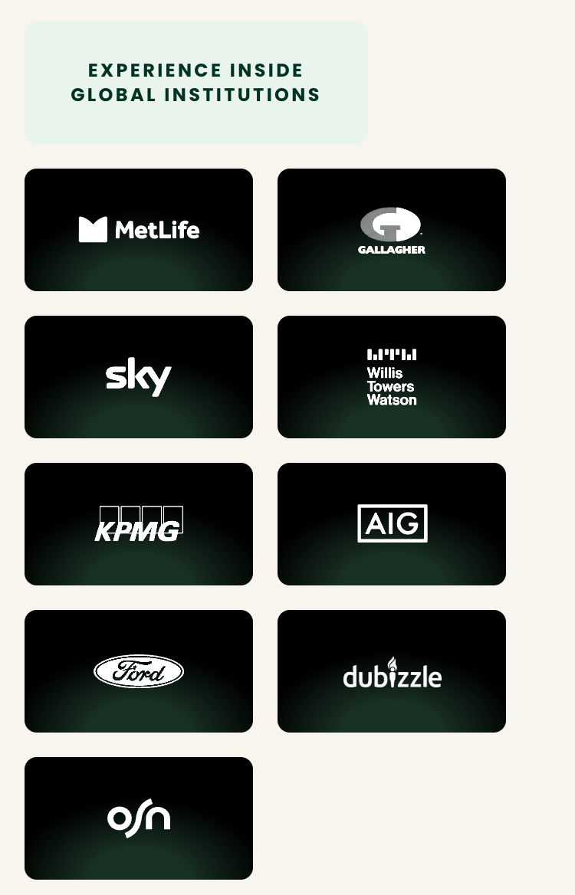
*On a phone, shown with movement turned off, so every logo is in view at once; otherwise the row scrolls: img/1-1-375.png*

### 1.2 · Done with a note

> The "Companies we have delivered for" strip has none of Cinnacare, Nurture UAE, Scentmatic or BookMeetings yet.

**What was done:** Cinnacare, Scentmatic, BookMeetings and Nurture UAE are now in the "Companies we have delivered for" row after Nivishe, on dark rounded tiles the same size as the others, with none of the existing companies gone and Nurture in its own purple app icon, because showing it in white like the other logos would hide the word. For visitors who have set their phone or computer to reduce movement, the row wraps onto extra lines so that every logo shows.

**Note:** As in the institutions row, the four new tiles do not have the faint green glow of the older ones, so side by side they look slightly greyer. The Nurture icon is noticeably smaller than the logos beside it, and the word "Nurture" on it is readable but small. The order is Cinnacare, Scentmatic, BookMeetings, Nurture UAE, where your list said Cinnacare, Nurture UAE, Scentmatic, BookMeetings.

**Live page:** https://pivotprime.ae/

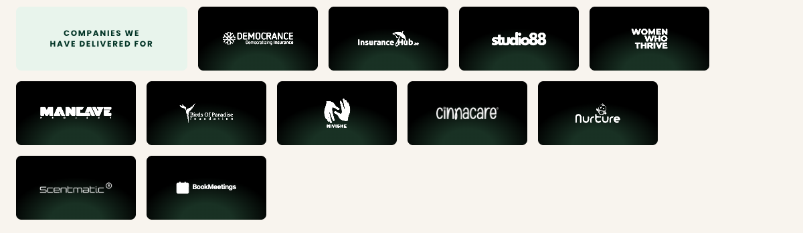
*On a computer, shown with movement turned off, so every logo is in view at once; otherwise the row scrolls: img/1-2.png*

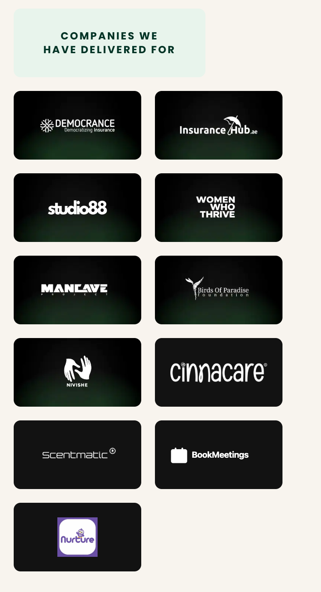
*On a phone, shown with movement turned off, so every logo is in view at once; otherwise the row scrolls: img/1-2-375.png*

## Slide 2

### 2.1 · Done with a note

> [1] Have refined it so it reads as 3 cards under diagnose, lead and build.

**What was done:** The services section on the homepage and on the Services page now shows three cards, headed "WE DIAGNOSE", "WE LEAD" and "WE BUILD" in pale green labels, with your three titles in green. On a computer they sit side by side at equal widths, and on a phone they stack one under another in the same order.

**Note:** Two things differ from your picture. Each pale green label is only as wide as its words, where yours runs the full width of the card, and its lettering is a mid green rather than your bold dark forest green, which makes it harder to read. The label ends are fully rounded, as in your picture. An earlier update wrongly described them as square-cornered.

**Live page:** https://pivotprime.ae/#services

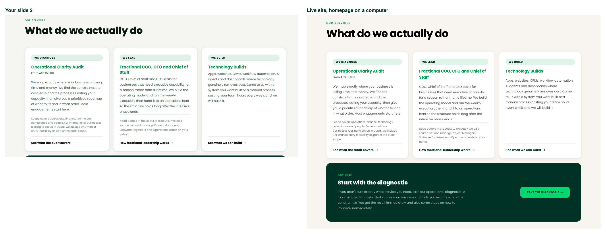
*Your slide and the live site: img/2-1-compare.png*

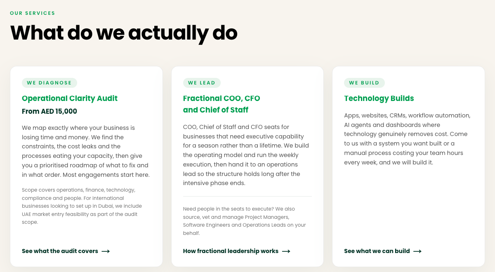
*On a computer: img/2-1.png*

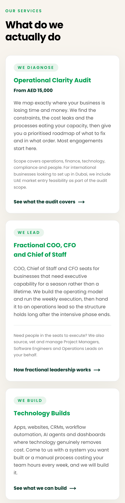
*On a phone: img/2-1-375.png*

### 2.2 · Done with a note

> And only 3 offers now, see the html for this here - https://claude.ai/code/artifact/eeb21f42-35a9-4dce-ac61-a9c22f2faa19

**What was done:** Build and Place is now a short note in the We Lead card, and UAE Market Entry is a sentence in the We Diagnose card's note, both worded as in your picture, so the section shows only three offers. The page you linked still shows both as full offers, so the site follows your picture and your 30 September note instead.

**Note:** In your picture the We Diagnose and We Build cards have a thin line above their link; on the site only the We Lead card has a line, above its note. The "From AED 15,000" line is bold and dark, and on a computer slightly larger than the text around it, where yours is plain, smaller and grey-green. The dark panel underneath uses the wording of the page you linked, "NOT SURE" and "...also some steps on how to improve, immediately", rather than your picture's "NOT SURE WHERE TO START" and "...along with specific steps on how to start fixing it". Its "TAKE THE DIAGNOSTIC" button has no arrow, although your picture and your linked page both show one.

**Live page:** https://pivotprime.ae/#services

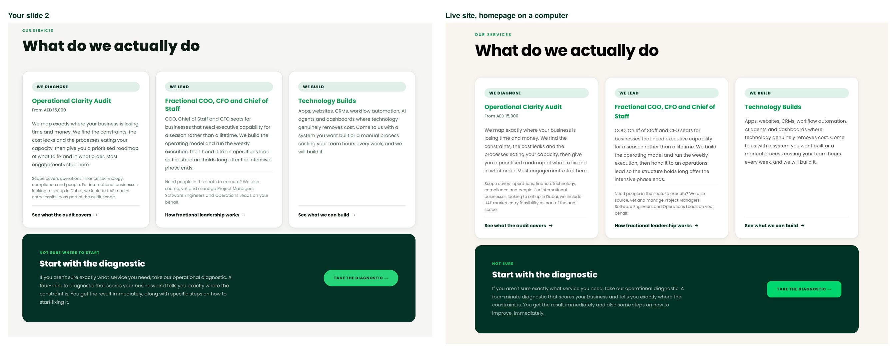
*Your slide and the live site: img/2-2-compare.png*

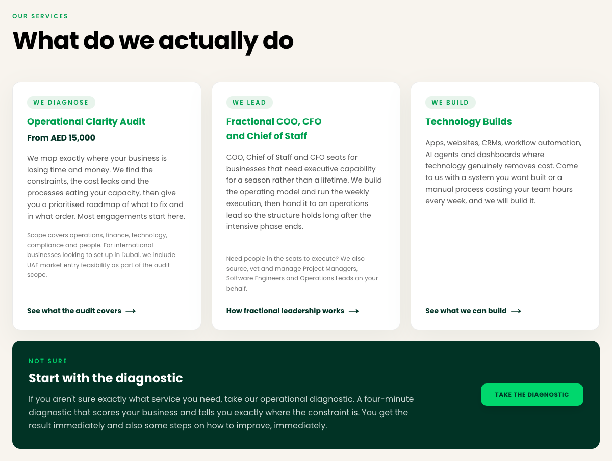
*On a computer: img/2-2.png*

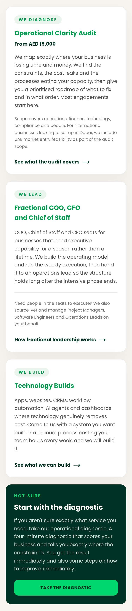
*On a phone: img/2-2-375.png*

### 2.3 · Done with a note

> The Services page still says "which of the five you actually need". Change it to three.

**What was done:** The Services page no longer says "five" anywhere. The sentence was in the old sixth card, which your diagnostic panel replaced, so it has gone rather than being reworded, and the line under the heading now begins "Three services, used on their own or together."

**Note:** Because the sentence has gone, the page has no line saying "which of the three you actually need". The short description that search engines show for the Services page, which is not visible on the page itself, still lists the five old services: operational audits, fractional leadership, embedded delivery teams, technology builds and UAE market entry.

**Live page:** https://pivotprime.ae/services

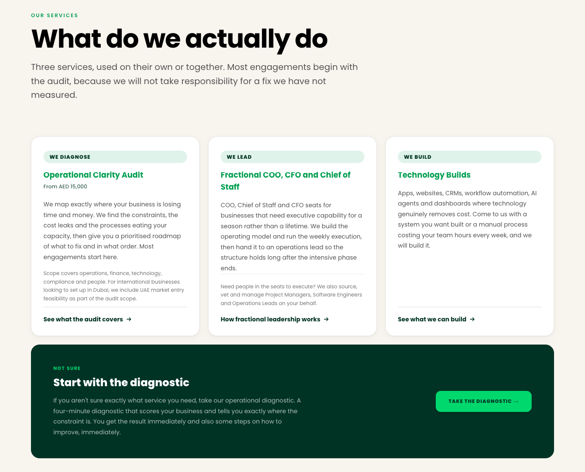
*On a computer: img/2-3.png*

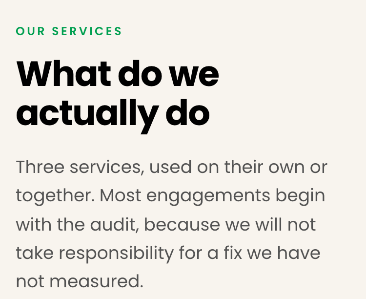
*On a phone: img/2-3-375.png*

## Slide 3

### 3.1 · Done with a note

> [1] Eyebrow heading - Meet the CEO & Founder

**What was done:** The founder section on the homepage now opens with your eyebrow heading, "MEET THE CEO & FOUNDER", in small green capitals just above the main heading.

**Note:** The wording follows your written note rather than the "Our CEO and Founder" shown in your picture. The green on the cream background has about the same contrast as in your picture, which is below the level usually recommended for small text, so some visitors may find it a little hard to read.

**Live page:** https://pivotprime.ae/

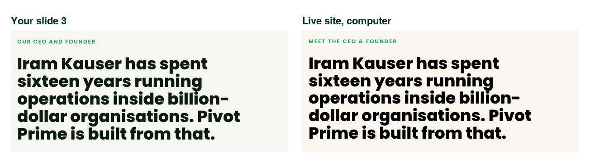
*Your slide and the live site: img/3-1-compare.png*

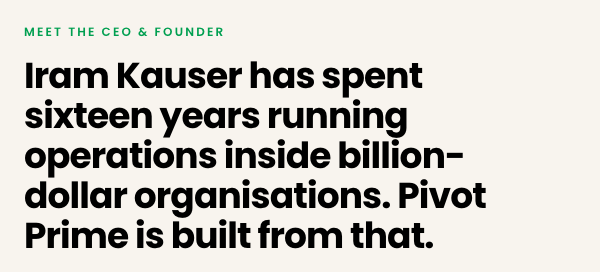
*On a computer: img/3-1.png*

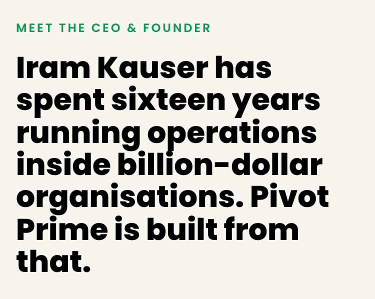
*On a phone: img/3-1-375.png*

### 3.2 · Done

> then as per second pic here

**What was done:** The section now runs as in your second picture: the eyebrow heading, your main heading, your two paragraphs, then a "MEET THE FULL TEAM" button that opens the team section of the About page. Your photo stays on the right on a computer, and above the text on a phone.

**Live page:** https://pivotprime.ae/

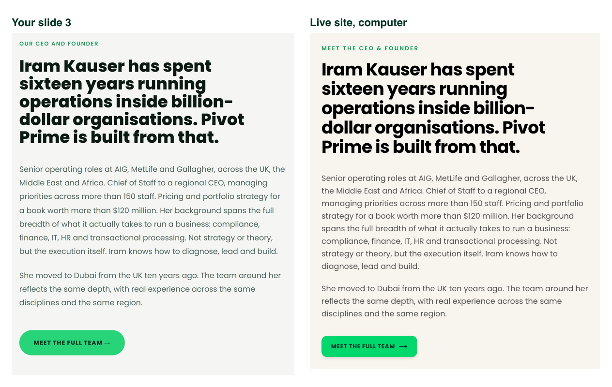
*Your slide and the live site: img/3-2-compare.png*

*On a computer: img/3-2.png*

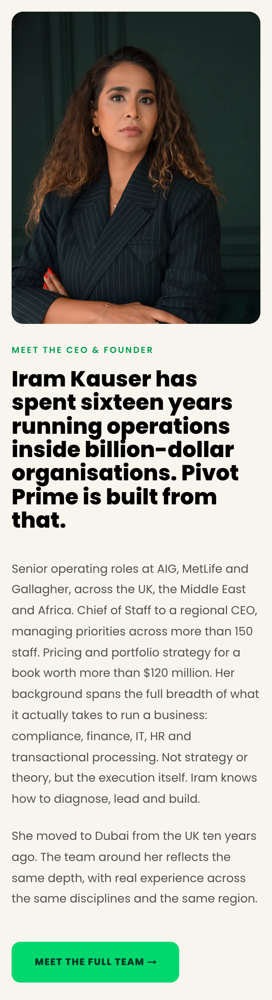
*On a phone: img/3-2-375.png*

### 3.3 · Done

> but keep my photo of course

**What was done:** Your photograph is kept, the same picture with the same framing. On a computer it sits to the right of the new text, and on a phone it sits above it, with your head fully in the frame.

**Live page:** https://pivotprime.ae/

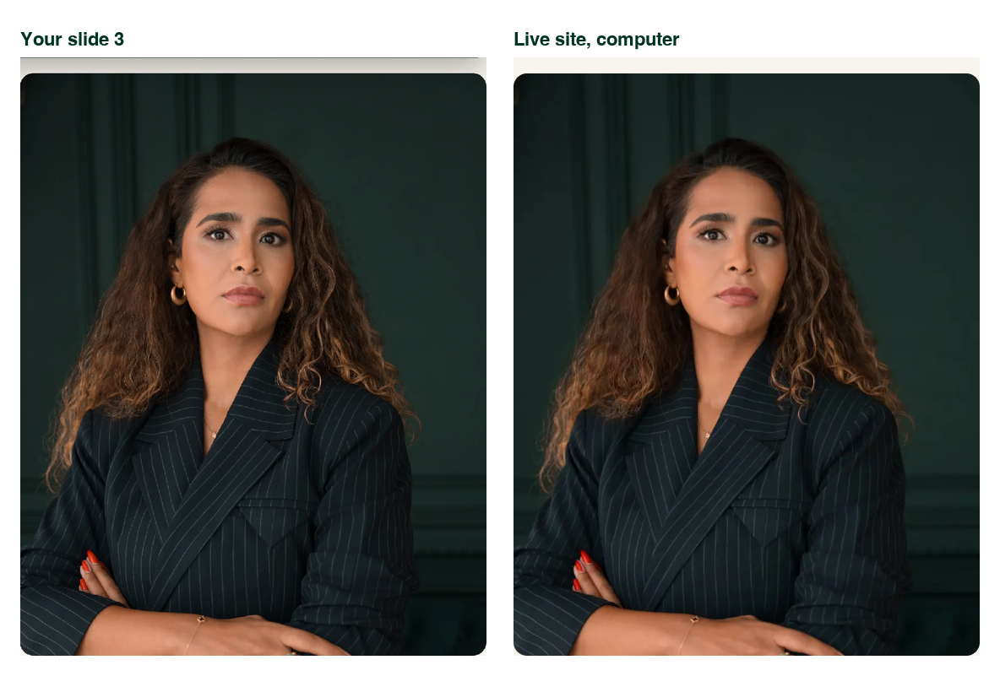
*Your slide and the live site: img/3-3-compare.png*

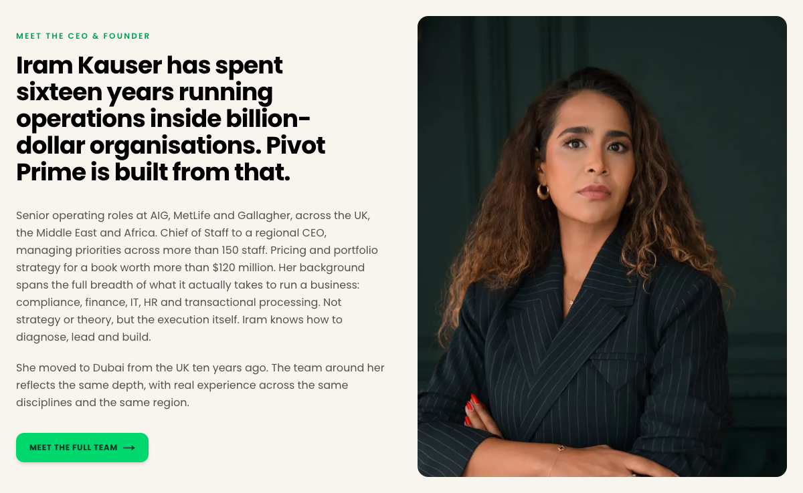
*On a computer: img/3-3.png*

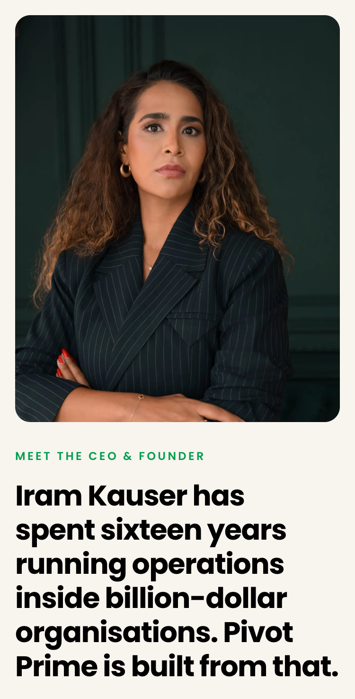
*On a phone: img/3-3-375.png*

### 3.4 · Done

> [2] – Use right hand side text and heading please.

**What was done:** The old heading about the mathematician and both old paragraphs are gone from the homepage. Your heading and two paragraphs from the right-hand picture are in place word for word, with "$120 million" written out in full.

**Live page:** https://pivotprime.ae/

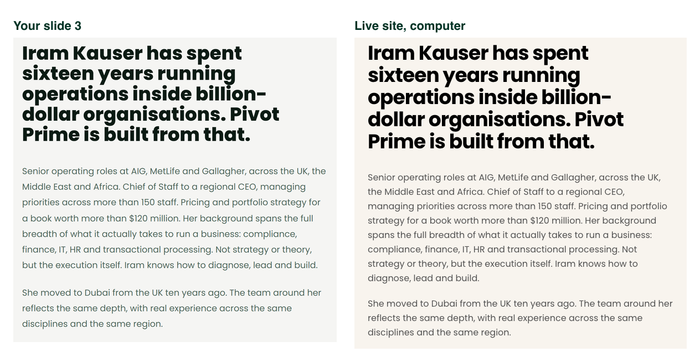
*Your slide and the live site: img/3-4-compare.png*

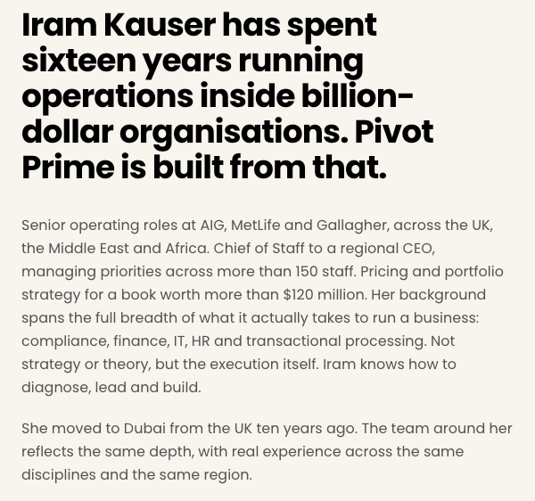
*On a computer: img/3-4.png*

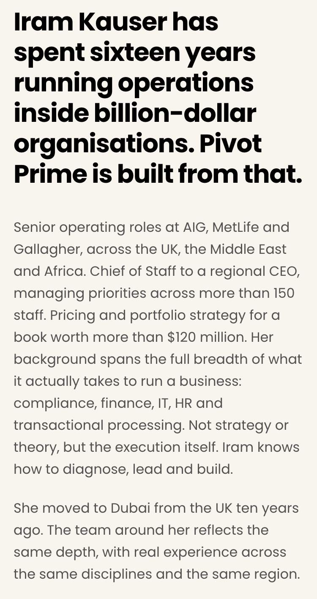
*On a phone: img/3-4-375.png*

### 3.5 · Done

> [3) reminder buttons to remain rectangular as currently is

**What was done:** The button in this section keeps its rectangular shape with small rounded corners, as before, and so does the "TALK TO US" button in the top bar. None of the homepage buttons has become pill-shaped.

**Live page:** https://pivotprime.ae/

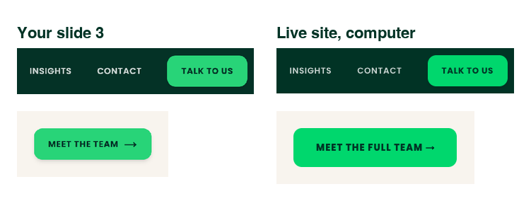
*Your slide and the live site: compare the button's shape; its wording changed on your later instruction: img/3-5-compare.png*

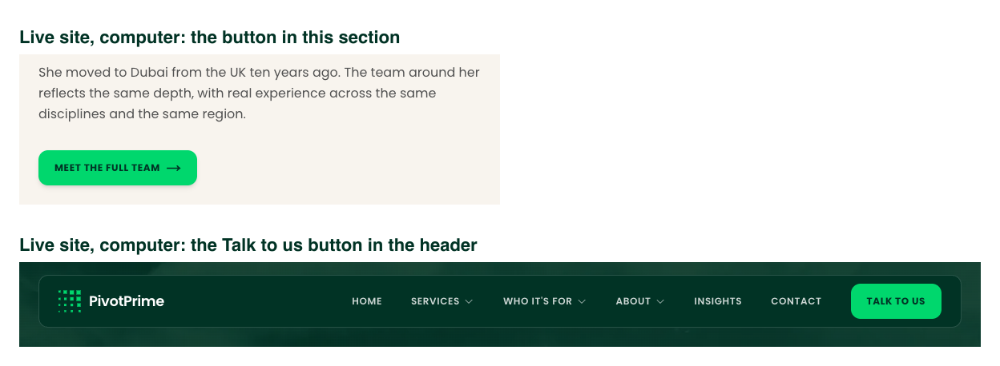
*On a computer: img/3-5.png*

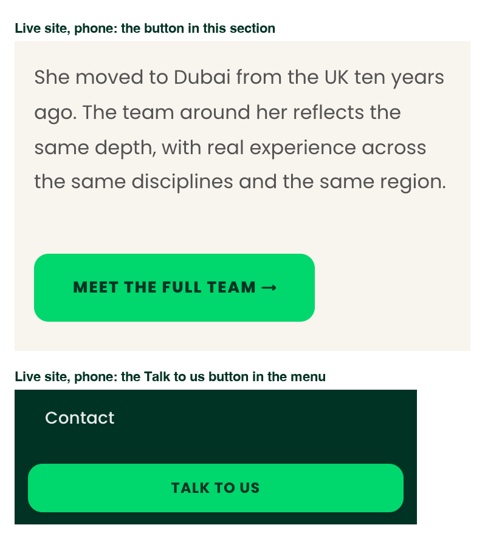
*On a phone: img/3-5-375.png*

## Slide 4

### 4.1 · Done

> [1] Below add my linked in page, and say connect with Iram on Linkedin

**What was done:** Your card on the About page now has a green "Connect with Iram on LinkedIn" button under your biography and tags, in the same style as the rest of the team's buttons. It opens the LinkedIn address Saif supplied for you in a new tab, rather than the company page.

**Live page:** https://pivotprime.ae/about#team

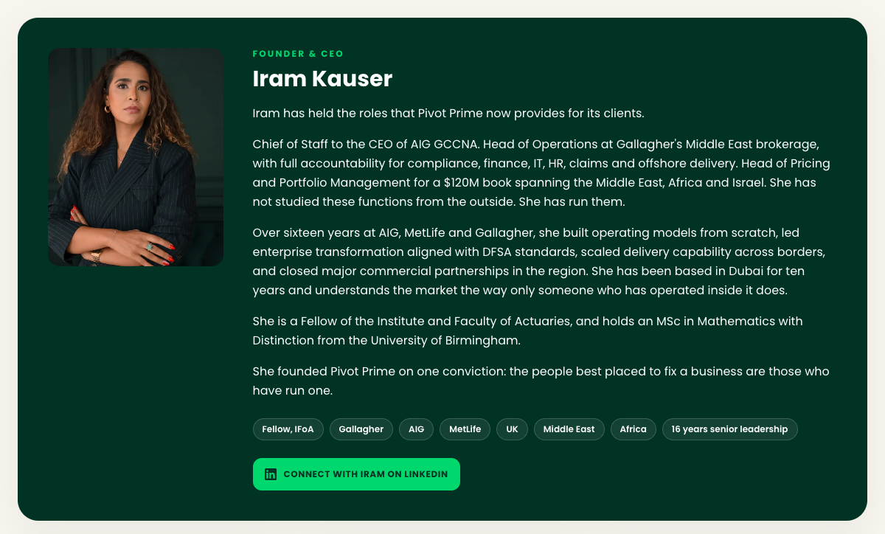
*On a computer: img/4-1.png*

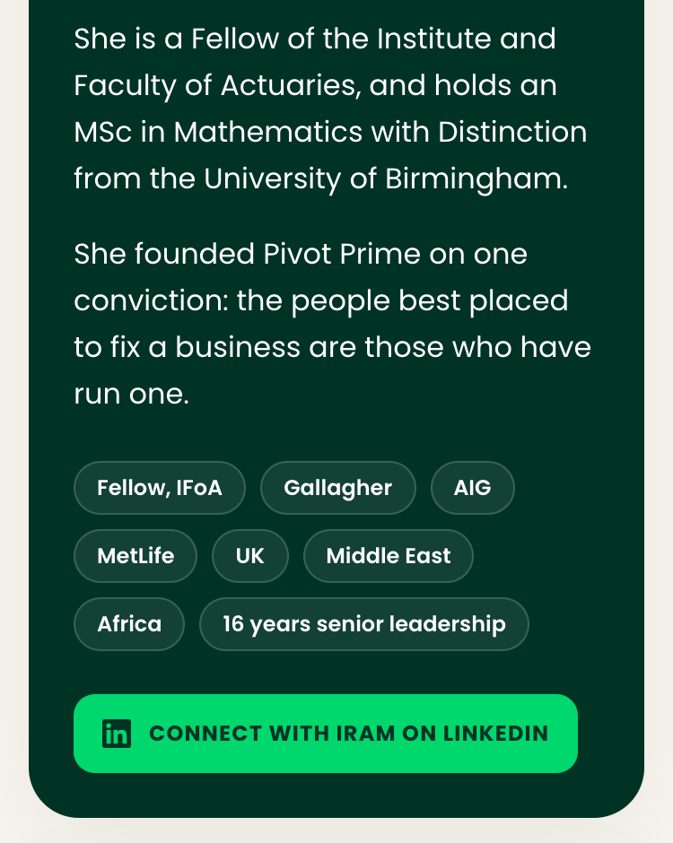
*On a phone: img/4-1-375.png*

### 4.2 · Done

> do this for all staff.

**What was done:** Justin, Nisha, Saif and Khushi each have the same green "Connect with ... on LinkedIn" button under their biography and tags. Each one opens that person's own LinkedIn address from your team file in a new tab.

**Live page:** https://pivotprime.ae/about#team

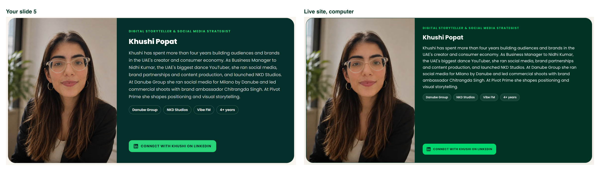
*Your slide and the live site: img/4-2-compare.png*

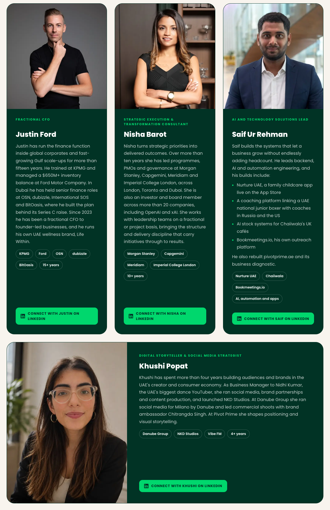
*On a computer: img/4-2.png*

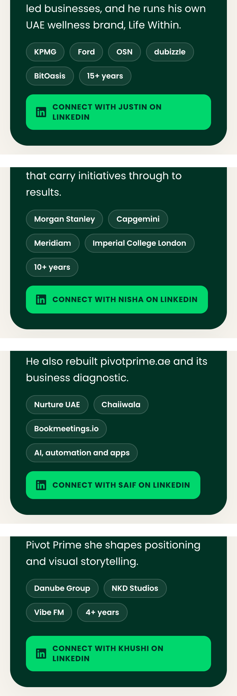
*On a phone: img/4-2-375.png*

### 4.3 · Done with a note

> [2] Under the heading of my name, the text will be:
> Iram has held the roles that Pivot Prime now provides for its clients.
> Chief of Staff to the CEO of AIG GCCNA. Head of Operations at Gallagher's Middle East brokerage, with full accountability for compliance, finance, IT, HR, claims and offshore delivery. Head of Pricing and Portfolio Management for a $120M book spanning the Middle East, Africa and Israel. She has not studied these functions from the outside. She has run them.
> Over sixteen years at AIG, MetLife and Gallagher, she built operating models from scratch, led enterprise transformation aligned with DFSA standards, scaled delivery capability across borders, and closed major commercial partnerships in the region. She has been based in Dubai for ten years and understands the market the way only someone who has operated inside it does.
> She is a Fellow of the Institute and Faculty of Actuaries,and holds an MSc in Mathematics with Distinction from the University of Birmingham.
> She founded Pivot Prime on one conviction: the people best placed to fix a business are those who have run one.

**What was done:** Your new biography is under your name on the About page, in five paragraphs, in your order and word for word as you wrote it, on a computer and on a phone.

**Note:** Your slide reads "Actuaries,and" with no space after the comma; the site reads "Actuaries, and", with one space added. Every other character matches your text exactly.

**Live page:** https://pivotprime.ae/about#team

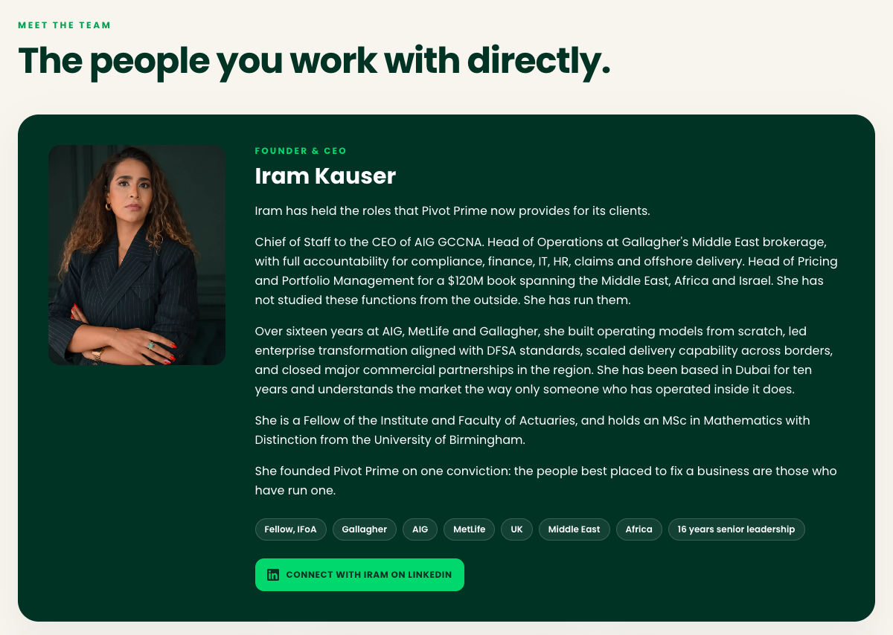
*On a computer: img/4-3.png*

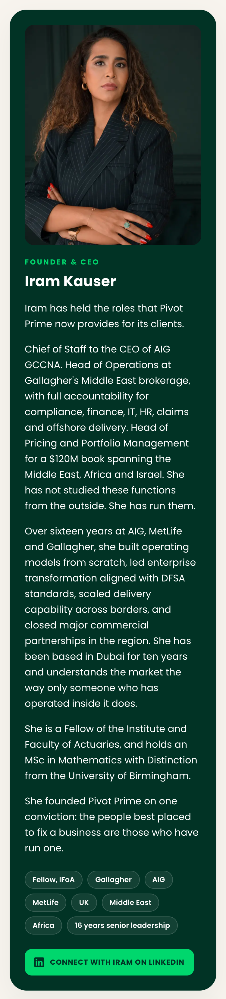
*On a phone: img/4-3-375.png*

### 4.4 · Done

> Tags: Fellow, IFoA · Gallagher · AIG · MetLife · UK · Middle East · Africa · 16 years senior leadership.

**What was done:** The tags under your biography follow your line exactly and in your order, as eight separate tags from "Fellow, IFoA" to "16 years senior leadership", with Gallagher before AIG and MetLife. The old grouped tags are gone.

**Live page:** https://pivotprime.ae/about#team

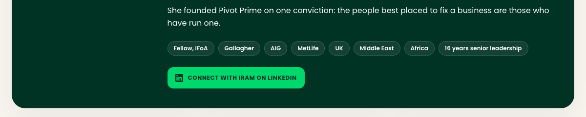
*On a computer: img/4-4.png*

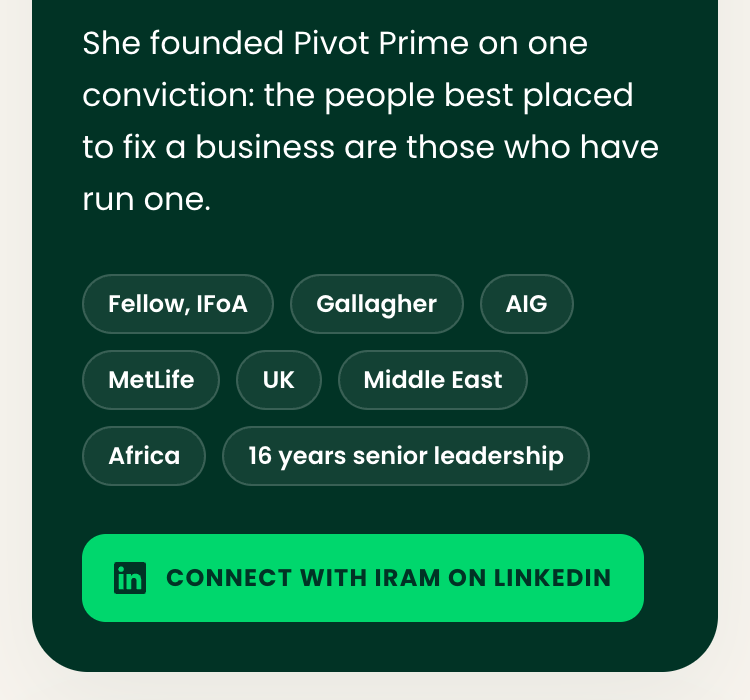
*On a phone: img/4-4-375.png*

## Slide 5

### 5.1 · Done with a note

> We have to add Nisha to the website – her bio and details are attached

**What was done:** Nisha is on the About page, second in the row between Justin and Saif. Her job title, biography, tags and LinkedIn button match your file on a computer and on a phone, and her photograph is the same picture, re-cut so there is space above her head as in yours.

**Note:** Her photograph is framed very slightly closer than yours, by about six per cent. It ends at her watch, where yours shows a little more below it, down to her bracelet and belt, and she sits a touch nearer the centre.

**Live page:** https://pivotprime.ae/about#team

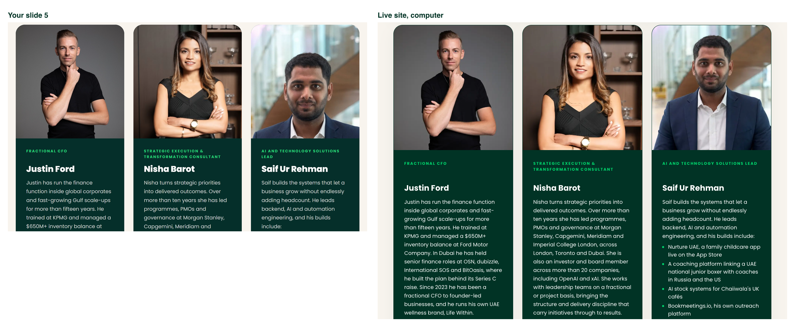
*Your slide and the live site: img/5-1-compare.png*

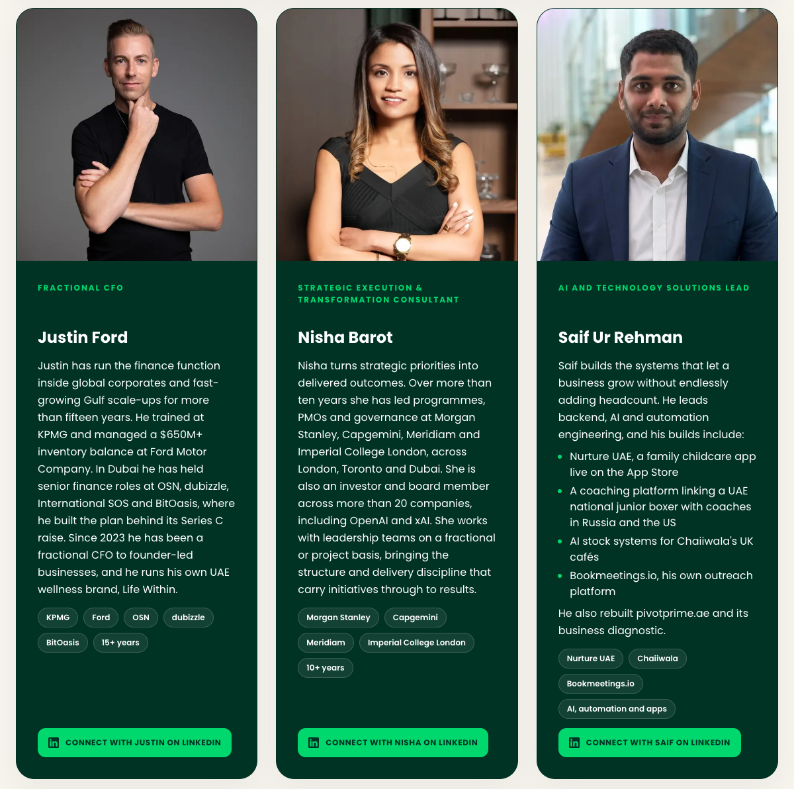
*On a computer: img/5-1.png*

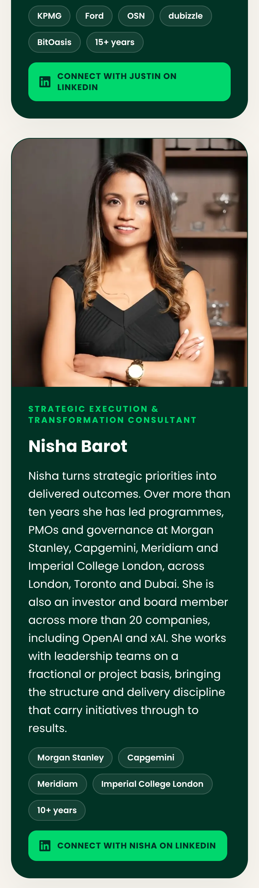
*On a phone: img/5-1-375.png*

### 5.2 · Done with a note

> Everyones bio sections to be updated a bit see attached html

**What was done:** Justin's, Nisha's, Saif's and Khushi's biographies, job titles and tags now read exactly as in your file, and the old seat labels and short biographies are gone. Khushi's wide card follows your file too: on a computer her text starts at the top with the LinkedIn button at the foot, and on a phone her photo is the same shape as the three above.

**Note:** A few small styling differences remain. The biography text is plain white where your file uses a slightly softer white; your tags are outlines where the site's have a faint fill; and your green panel is a touch more blue-green than the site's own dark green. On a computer there is a little more space between the job title and the name on Justin's, Nisha's and Saif's cards, which keeps the three names level on narrower screens, and Khushi's text sits slightly closer to the edge of her panel than in your file. Saif's photograph is framed wider than in your file, showing more of his jacket and the room behind him. It is the closer framing made on Saif's instruction on 3 September, and the tighter photo your file uses was not among the files we received.

**Live page:** https://pivotprime.ae/about#team

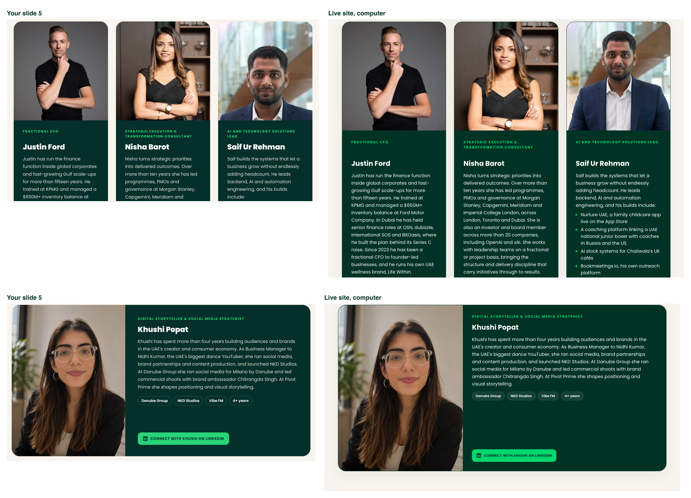
*Your slide and the live site: img/5-2-compare.png*

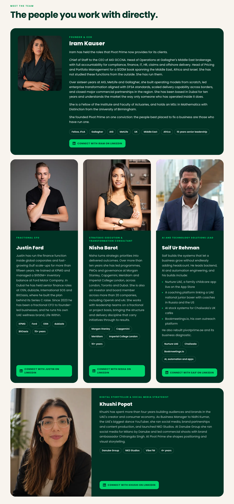
*On a computer: img/5-2.png*

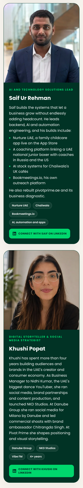
*On a phone: img/5-2-375.png*

### 5.3 · Done with a note

> Add everyone’s linked in to the bottom of their bios

**What was done:** Everyone on the team, including you, now has a green "Connect with [name] on LinkedIn" button at the foot of their biography, and each one opens that person's LinkedIn address in a new tab. Khushi's button now sits at the foot of her card, as in your picture.

**Note:** Your own button goes to linkedin.com/in/iram-kauser-79539938. Your team file lists links for the other four people only, so your address is the one Saif supplied.

**Live page:** https://pivotprime.ae/about#team

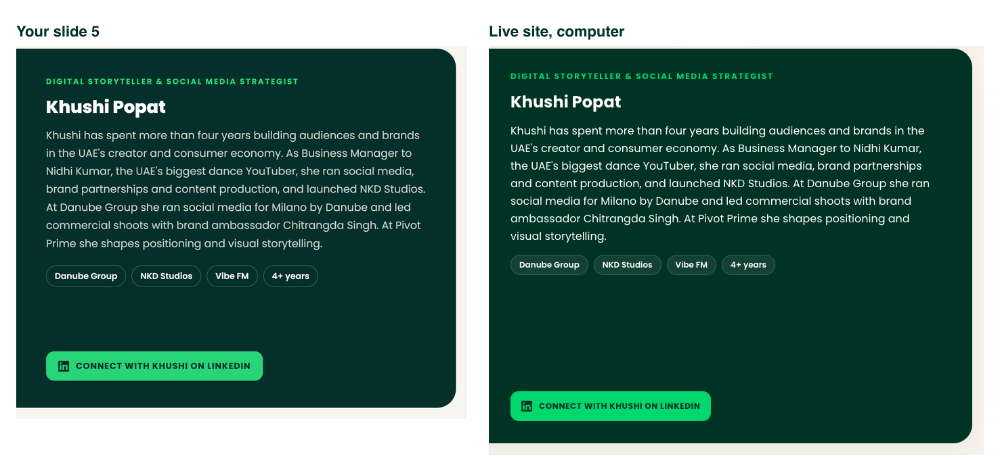
*Your slide and the live site: img/5-3-compare.png*

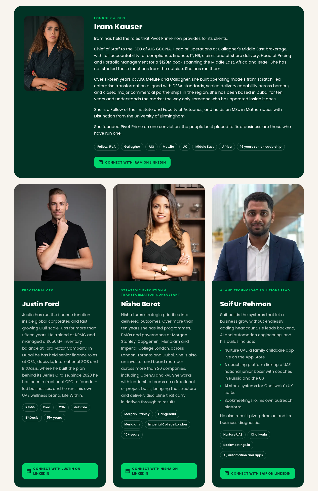
*On a computer: img/5-3.png*

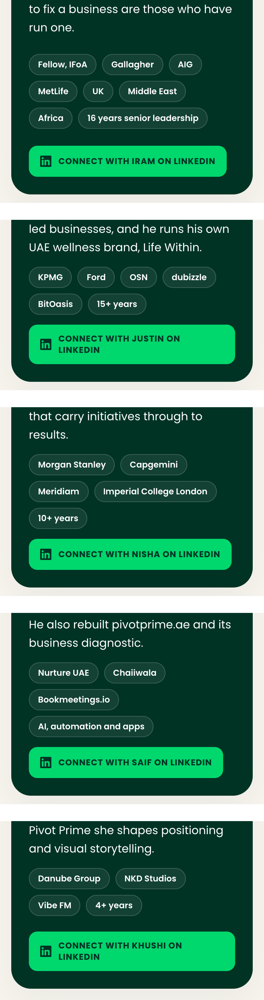
*On a phone: img/5-3-375.png*

## Slide 6

### 6.1 · Open

> Still to do: the Nurture screenshot still says "Good morning, Test App". Replace it with a live screenshot showing a real name.

**What was done:** Nothing has changed yet: the Nurture card on the homepage and the About page still shows "Good morning, Test App", because no new screenshot from the app has arrived. The name has not been painted over or cut out, as that would spoil the picture of the app.

**Still needed:** A screenshot of the live Nurture app's home screen, the same screen as now, showing a real-looking name in place of "Test App", taken from a demo account, because a real family's name and details should not appear on a public website. It is needed from you or Saif, taken on a phone in the same tall shape, and it will simply replace the current picture on the same card.

**Live page:** https://pivotprime.ae/

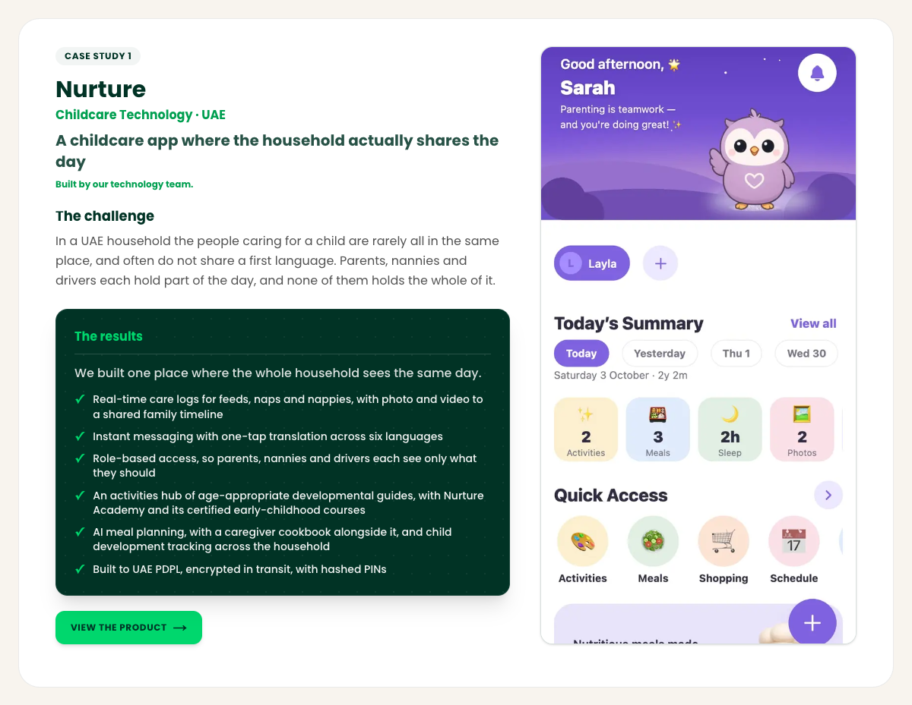
*On a computer: img/6-1.png*

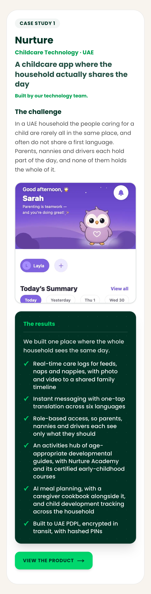
*On a phone: img/6-1-375.png*

## Slide 7

### 7.1 · Done with a note

> [1] FREE DIAGNOSTIC, SLIGHTLY BIGGER, OR HIGHLIGHTED,

**What was done:** The label on the diagnostic page now reads "FREE DIAGNOSTIC", without the old "Pivot Prime" in front. It is bigger than before and bigger than the small labels above headings elsewhere on the site, with the words in the mid green from your picture on a pale green highlight.

**Note:** Your picture has no box behind the label; the pale green box was added to highlight it, as you asked. The mid green words on the pale green box are below the contrast usually recommended for text this size, and slightly lower than in your own picture, so some visitors may find the label a little hard to read.

**Live page:** https://pivotprime.ae/diagnostic

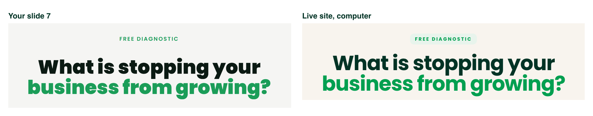
*Your slide and the live site: img/7-1-compare.png*

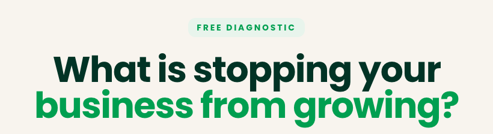
*On a computer: img/7-1.png*

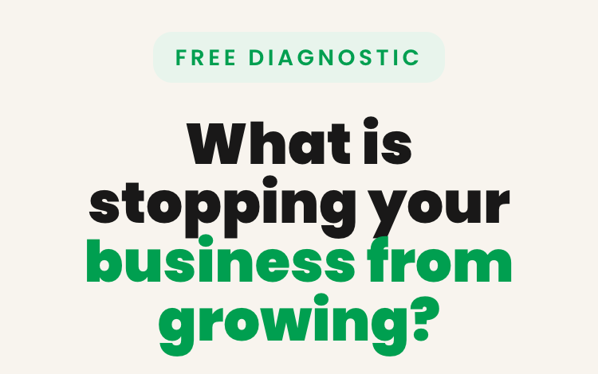
*On a phone: img/7-1-375.png*

### 7.2 · Done with a note

> [2] Main page to look like second pic shown here

**What was done:** The opening screen of the diagnostic now follows your second picture from top to bottom, centred: the label, the two-line heading, the paragraph, the four points with bright green dots, the "START THE DIAGNOSTIC" button with the arrow, and the small note underneath.

**Note:** Everything on the opening screen is smaller than in your picture: the paragraph, the four points and the note under the button are about two thirds of the size, and the button is the same size as the site's other green buttons. The button has slightly rounded corners rather than round ends, as your note [3] asks, and the label sits on a pale green highlight, following your note [1]. The first heading line and the paragraph use the site's own very dark green and neutral grey, where yours are near-black and grey-green, though they look almost the same.

**Live page:** https://pivotprime.ae/diagnostic

*Your slide and the live site: img/7-2-compare.png*

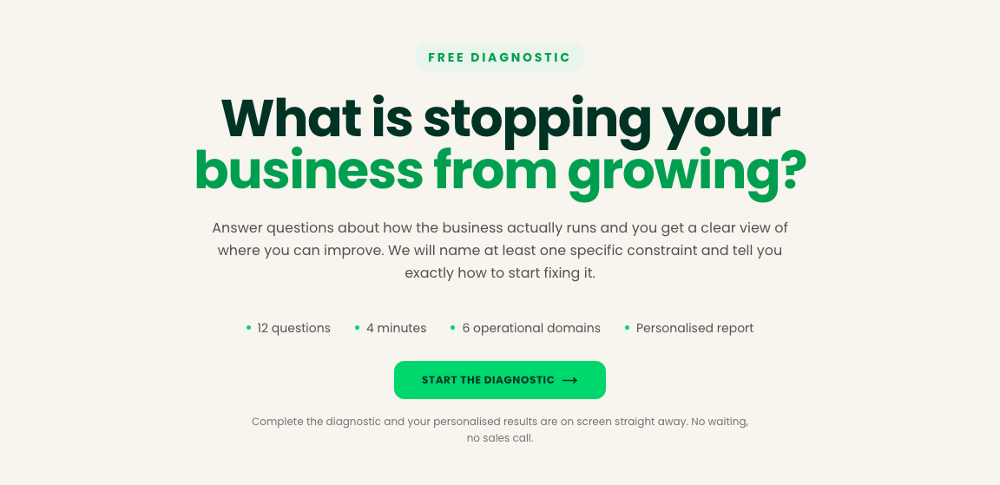
*On a computer: img/7-2.png*

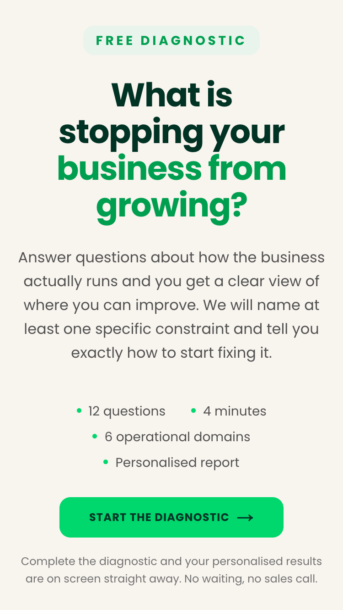
*On a phone: img/7-2-375.png*

### 7.3 · Done

> remove all the stretched founder stuff etc

**What was done:** The four reader cards, starting with "The stretched founder", are gone from the opening screen of the diagnostic. The paragraph now runs straight into the four points and the start button, with no gap left behind.

**Live page:** https://pivotprime.ae/diagnostic

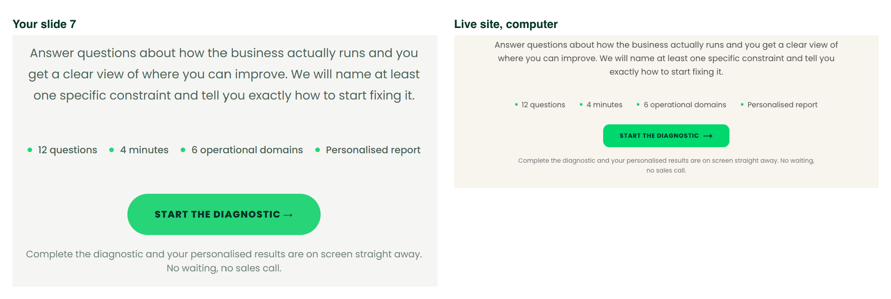
*Your slide and the live site: img/7-3-compare.png*

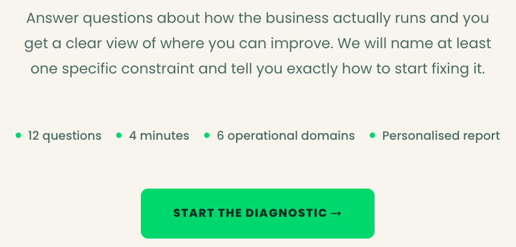
*On a computer: img/7-3.png*

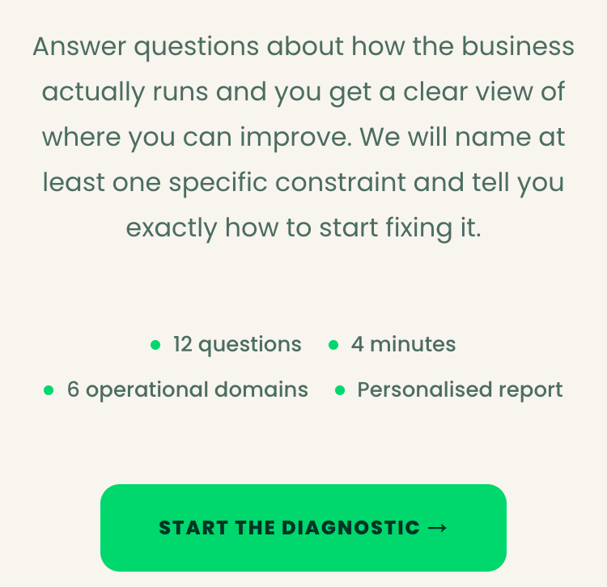
*On a phone: img/7-3-375.png*

### 7.4 · Done

> and have the lighter background similar to most of the website.

**What was done:** The dark green background is gone from the diagnostic's opening screen. It now sits on the same light cream as most of the website, under the usual dark green top bar, with dark and green text as in your picture.

**Live page:** https://pivotprime.ae/diagnostic

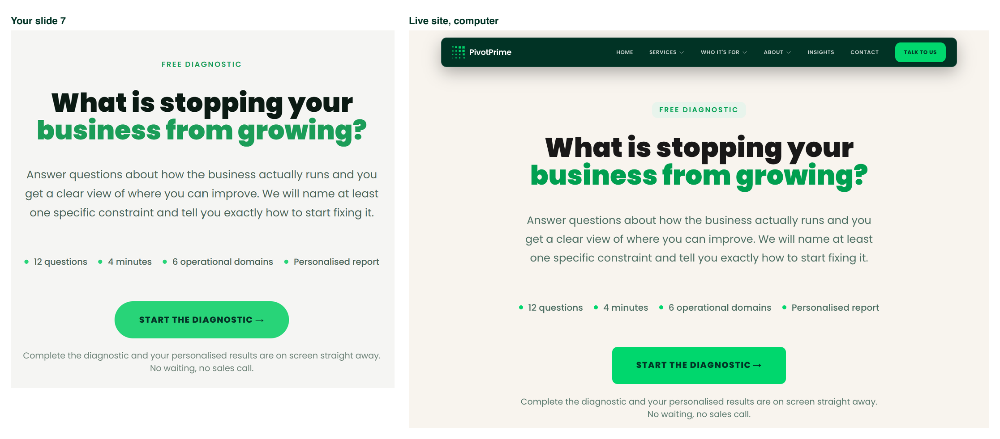
*Your slide and the live site: img/7-4-compare.png*

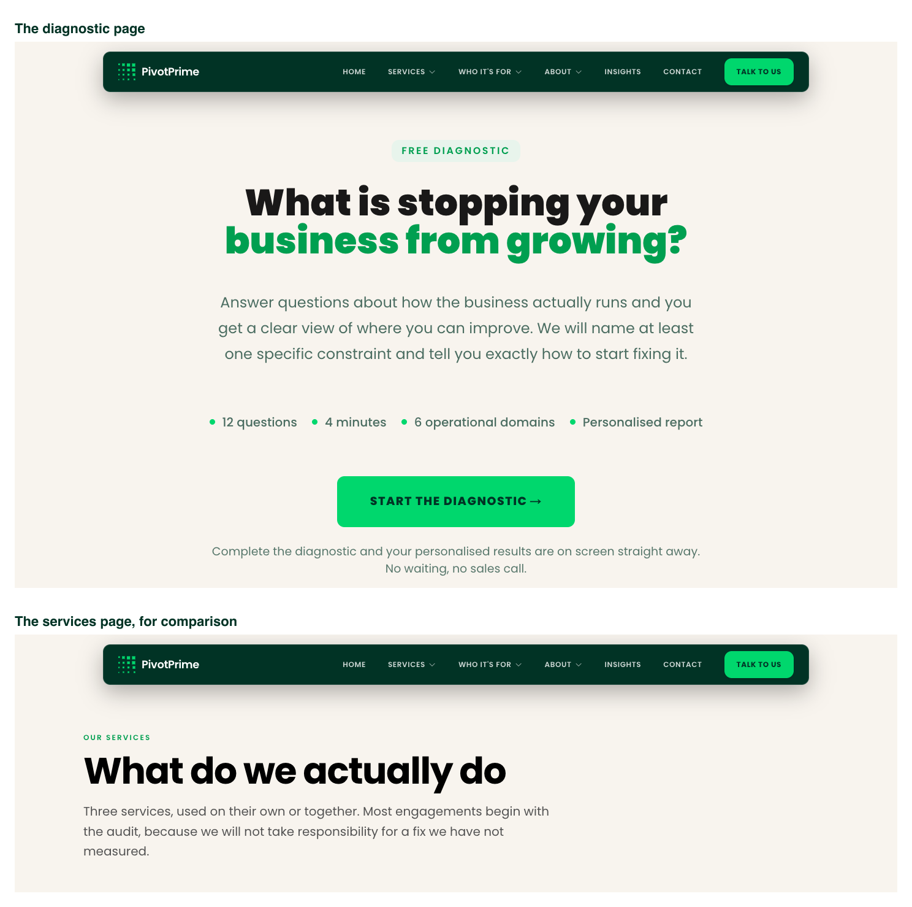
*On a computer: img/7-4.png*

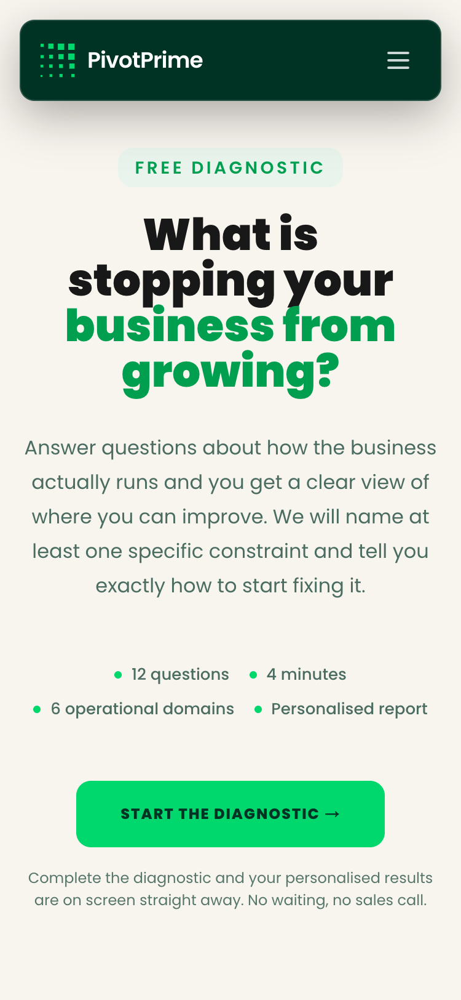
*On a phone: img/7-4-375.png*

### 7.5 · Done

> Keep wording as shown in this picture 

**What was done:** Every line on the diagnostic's opening screen now uses the wording from your picture, including the button, which reads "START THE DIAGNOSTIC" with the arrow, as you drew it. The old heading and paragraph are gone.

**Live page:** https://pivotprime.ae/diagnostic

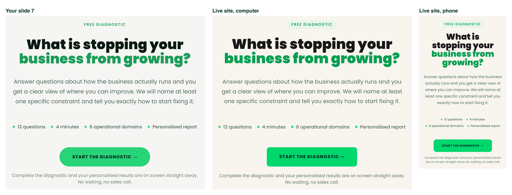
*Your slide and the live site: img/7-5-compare.png*

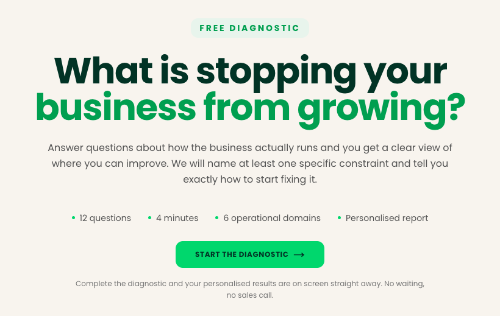
*On a computer: img/7-5.png*

*On a phone: img/7-5-375.png*

### 7.6 · Done

> [3], start the diagnostic button to be rectangular like all other buttons and example shown below

**What was done:** The start button now has the same slightly rounded rectangular corners, bright green fill and dark lettering as the homepage button in your example. It also uses the same capital lettering and size as the site's other green buttons.

**Live page:** https://pivotprime.ae/diagnostic

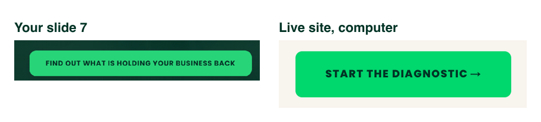
*Your slide and the live site: img/7-6-compare.png*

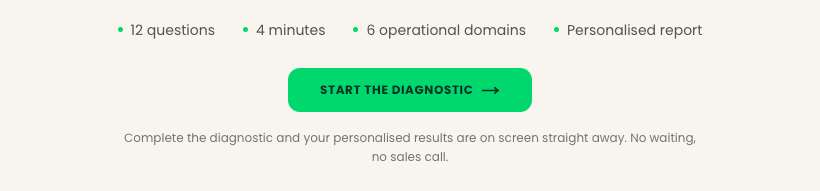
*On a computer: img/7-6.png*

*On a phone: img/7-6-375.png*

## Slide 8

### 8.1 · Done

> [1] I have to read all the different versions of advice we give, can you share

**What was done:** Every version of the advice is in a separate document sent with this report. It quotes your slide 8 note exactly and covers all six areas, each checked word for word against what the live diagnostic shows once someone enters their email address.

**Live page:** https://pivotprime.ae/diagnostic

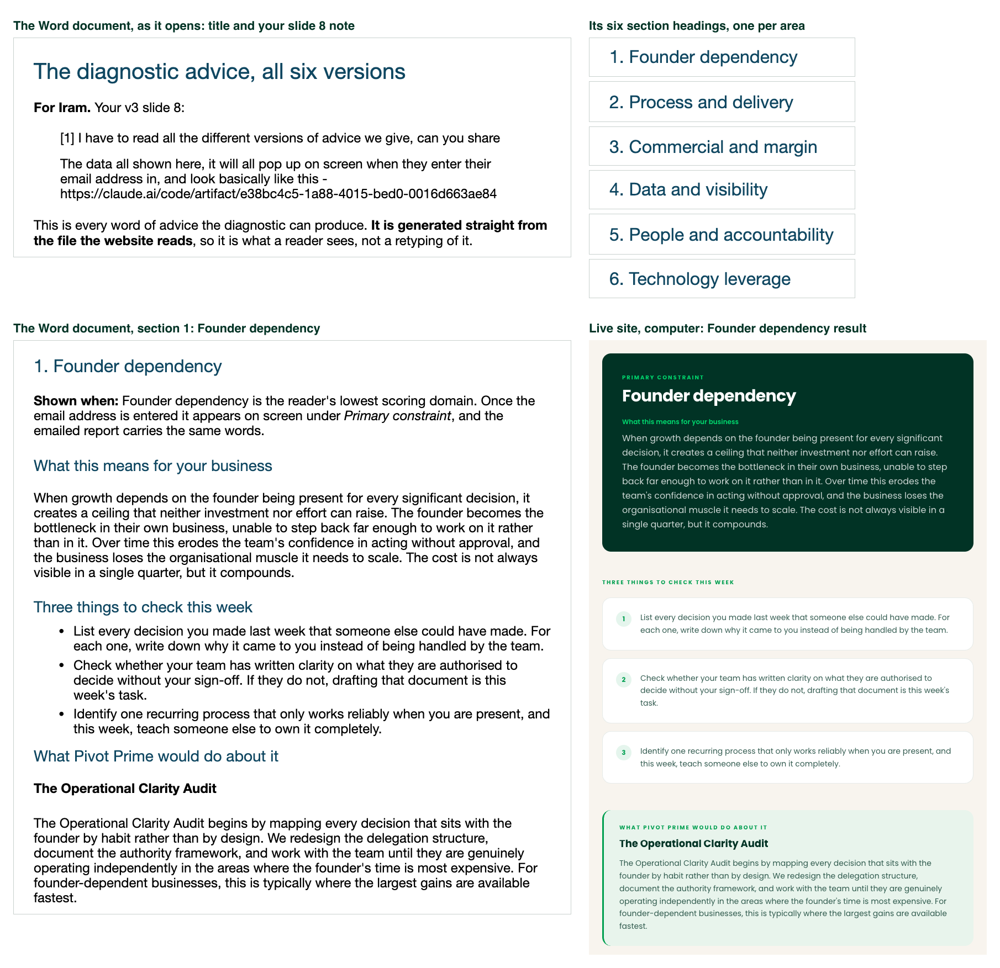
*On a computer: img/8-1.png*

### 8.2 · Done with a note

> The data all shown here, it will all pop up on screen when they enter their email address in, and look basically like this - https://claude.ai/code/artifact/e38bc4c5-1a88-4015-bed0-0016d663ae84

**What was done:** Once someone fills in their details and presses "Unlock my score", your three sections appear on the same screen, in your order and word for word as in your pictures, and none of them shows before that.

**Note:** The two buttons under them read "Book a call" and "Talk to us on WhatsApp" and are rectangular, following your later instructions rather than the round "Book a call with Iram" in your picture. The card above the sections still says the full report has been emailed and asks them to check their inbox. The site is still set to send that email, although no real report was sent during the check.

**Live page:** https://pivotprime.ae/diagnostic

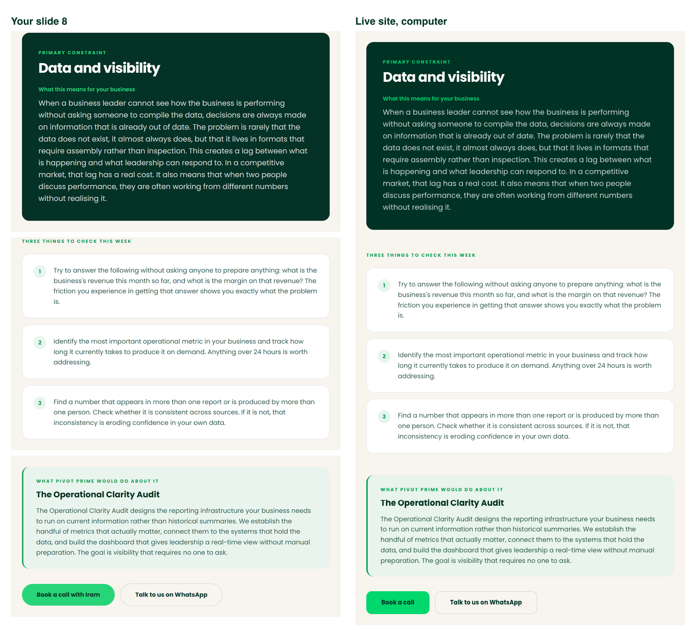
*Your slide and the live site: img/8-2-compare.png*

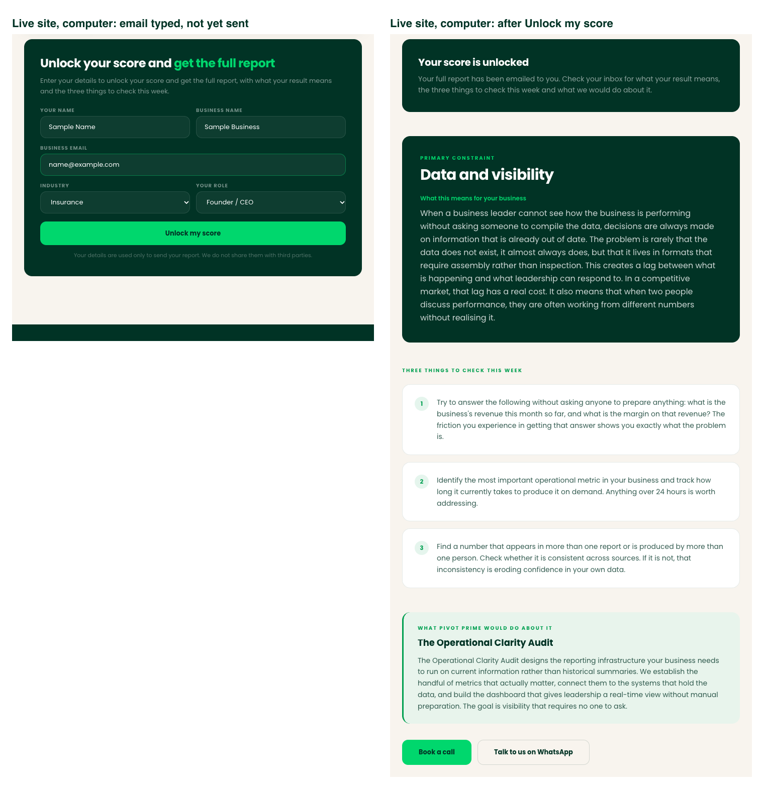
*On a computer: img/8-2.png*

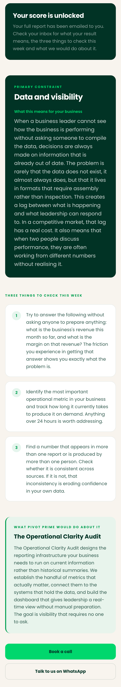
*On a phone: img/8-2-375.png*

### 8.3 · Done

> The "Unlock my score" button is still a round pill. Make it rectangular.

**What was done:** The "Unlock my score" button is rectangular, with the same small rounded corners as the site's other buttons, on a computer and on a phone, and it keeps that shape while it shows "Sending". Its wording and colours are unchanged.

**Live page:** https://pivotprime.ae/diagnostic

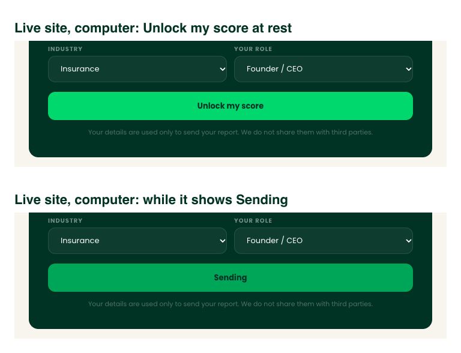
*On a computer: img/8-3.png*

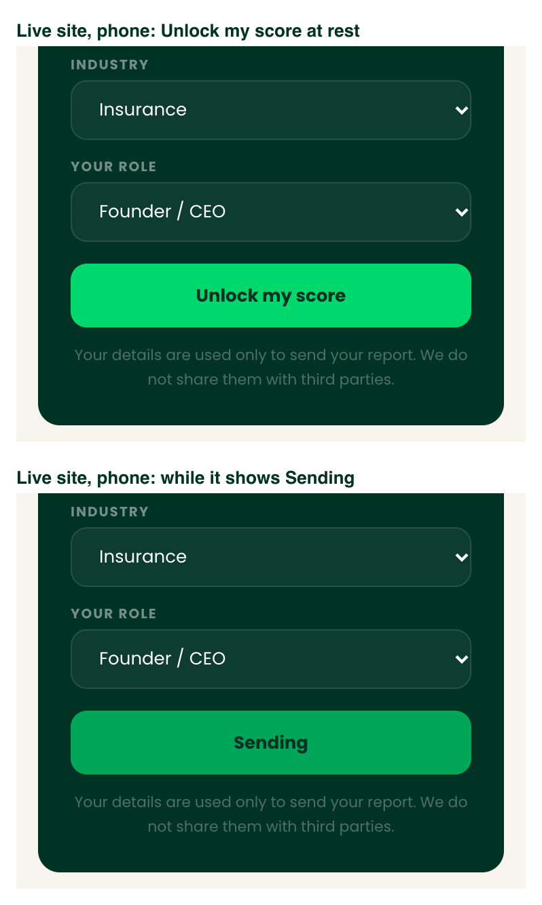
*On a phone: img/8-3-375.png*

## Slide 9

### 9.1 · Done with a note

> [1] Fix this, it doesn’t work when we subscribe

**What was done:** The sign-up was failing because the form sent from an email address the mail service had not approved; it now uses the same approved address as the contact form and the diagnostic. In the check, where the sign-up was stopped and answered inside the browser so that no email went out, pressing "Subscribe" replaced the email field and button with "You are on the list. The next piece comes to you." instead of the error in your picture.

**Note:** No real sign-up has been sent from start to finish, so that nobody was emailed: the form was checked on a computer and on a phone up to the point of sending. This means nobody has yet seen the two sign-up emails arrive, the confirmation to the subscriber and the notice to hello@pivotprime.ae. No list of subscribers is kept, so although the form promises "The next piece comes to you" and "Unsubscribe any time", nothing yet sends subscribers new articles or lets them unsubscribe (see 9.3 below).

**Live page:** https://pivotprime.ae/insights

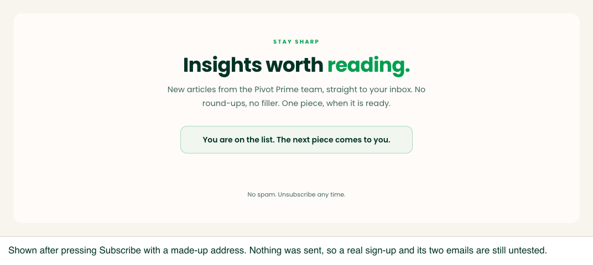
*On a computer: img/9-1.png*

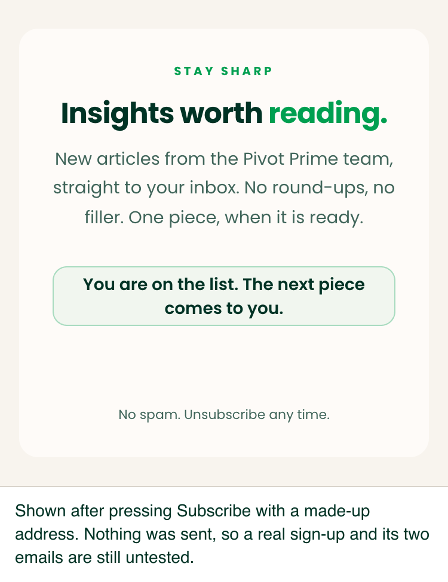
*On a phone: img/9-1-375.png*

### 9.2 · Done

> [2] fix the button here to be rectangular

**What was done:** The "Subscribe" button now has the same slightly rounded corners as the other buttons on the site instead of the full pill, on a computer and on a phone, and it keeps that shape while it shows "Sending". The email box beside it has the same corners, so the two match.

**Live page:** https://pivotprime.ae/insights

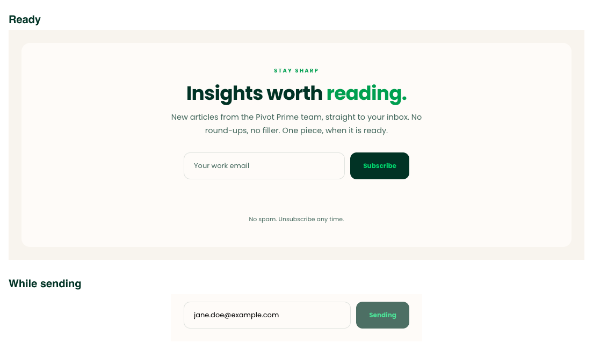
*On a computer: img/9-2.png*

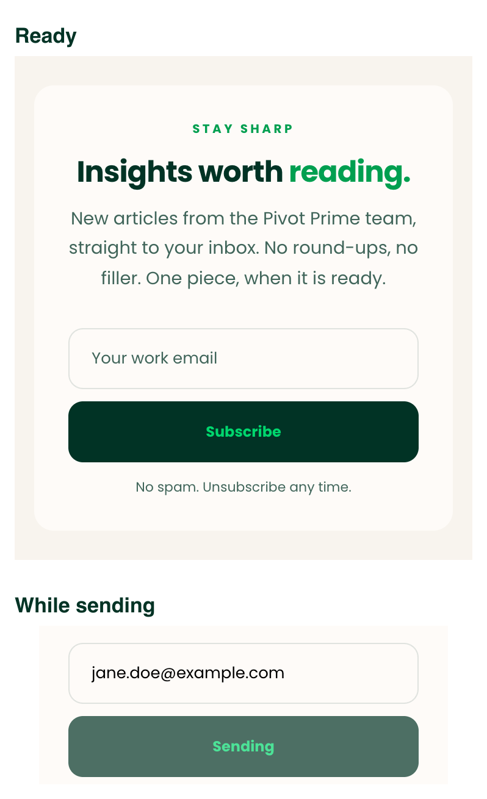
*On a phone: img/9-2-375.png*

### 9.3 · Open

> When the next article is published, test that subscribers receive the email and that its link opens the article.

**What was done:** This test has not been done yet: the September articles went live on 1 October, but the site has not emailed them to anyone, because nothing on the site emails subscribers when an article is published and no list of subscribers is kept. Each sign-up is only meant to produce a notice in the hello@pivotprime.ae inbox and a confirmation to the subscriber, and neither email has yet been seen arriving.

**Still needed:** Needed from you or Saif: a way of emailing subscribers when a new article is published; the addresses of the people who have signed up so far, gathered from any sign-up notices in the hello@pivotprime.ae inbox; and a decision on whether the three September articles should now be sent to them. The test can then be run on the next article.

**Live page:** https://pivotprime.ae/insights

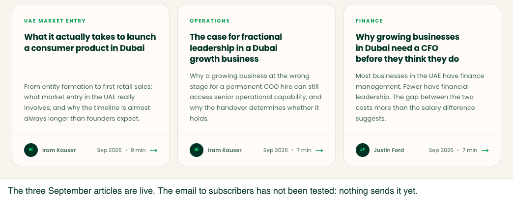
*On a computer: img/9-3.png*

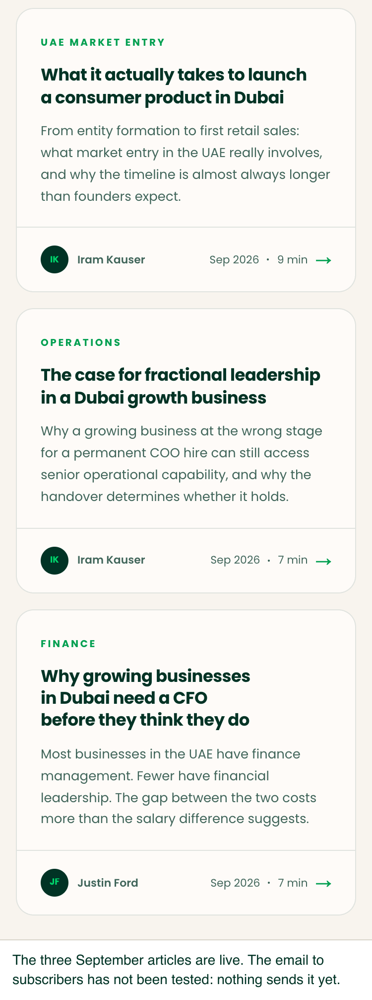
*On a phone: img/9-3-375.png*

## Slide 10

### 10.1 · Done with a note

> [1] Add the three articles shown below, for September – find full articles at –
> https://claude.ai/code/artifact/374a7554-969c-4e4f-bb74-a4056085bd13

**What was done:** The three September articles are now on the Insights page, after the August ones and in the order your picture shows, and each opens its own page with the full article from your link, word for word. The four August articles are still there, so the page now lists seven.

**Note:** The cards use the same design as the August cards, so a few details differ from your picture: the date and reading time sit beside the author's name rather than under it, the initials are bright green rather than white, and on a computer the cards are narrower, so "The case for fractional leadership in a Dubai growth business" runs to three lines instead of two. On a computer there is also a gap under the UAE Market Entry card's title, the line above the author runs the full width of the card, and the cards are a warm off-white on cream rather than your pure white on grey. The category tabs are unchanged ("All", "Execution", "Leadership", "Technology" and "Finance"), so the UAE Market Entry and fractional leadership articles appear only under "All", while the CFO article also appears under "Finance". Each article page shows the short summary from its card as a line under the headline, and the author's role, as used on the August articles, sits under each name.

**Live page:** https://pivotprime.ae/insights

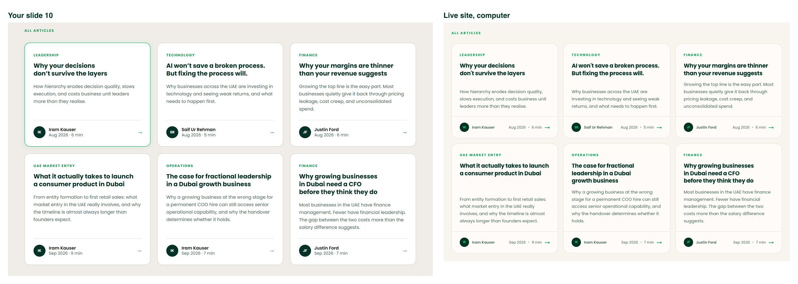
*Your slide and the live site: img/10-1-compare.png*

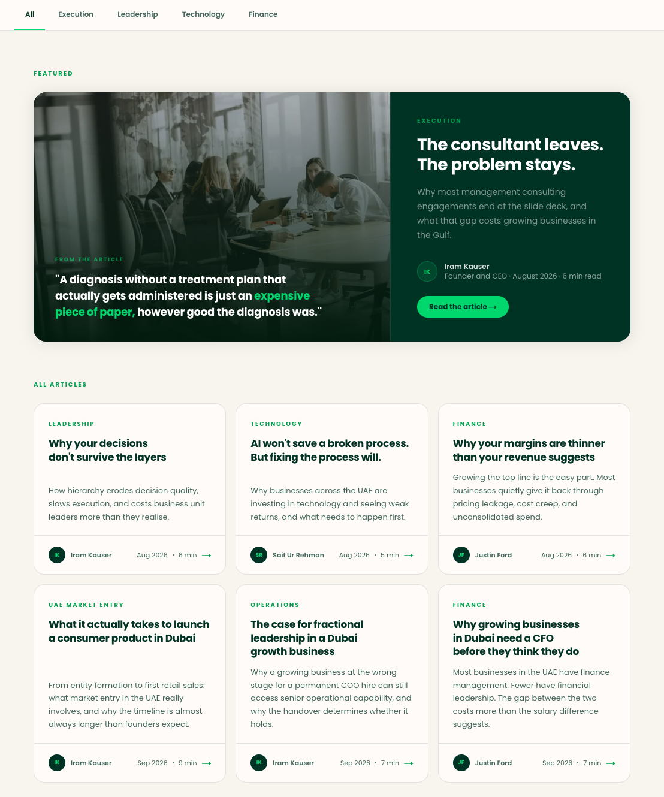
*On a computer: img/10-1.png*

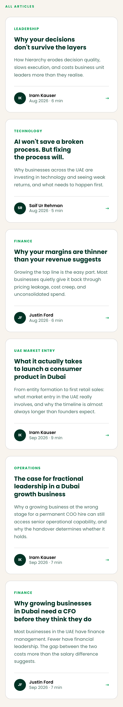
*On a phone: img/10-1-375.png*

### 10.2 · Done with a note

> fractional CFO (by Justin Ford)

**What was done:** The CFO article is credited to Justin Ford, with his initials, both on its card on the Insights page and on the article page itself, where his role, "Fractional CFO, Pivot Prime", sits under his name.

**Note:** This follows your slide 10 and its picture, which name Justin. The articles page you linked credits this article to you, so that page was not followed on this point.

**Live page:** https://pivotprime.ae/insights/fractional-cfo

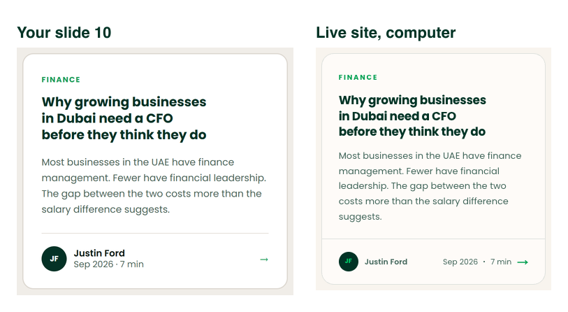
*Your slide and the live site: img/10-2-compare.png*

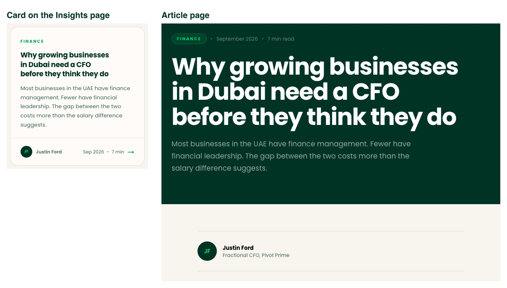
*On a computer: img/10-2.png*

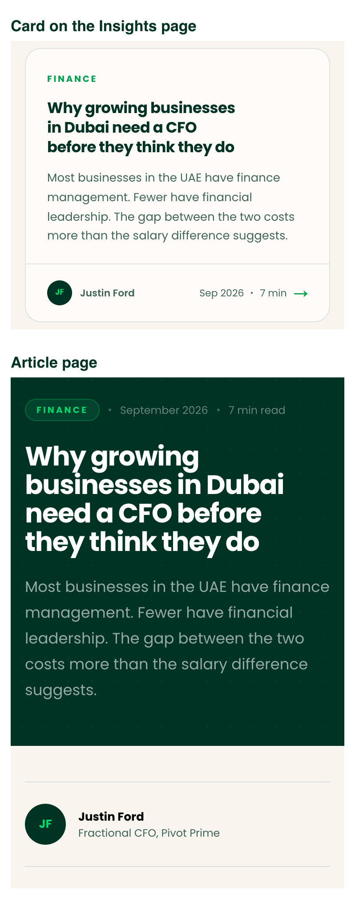
*On a phone: img/10-2-375.png*

## Slide 11

### 11.1 · Done with a note

> Please use one content width for every section, so all headings, cards and buttons start on the same left edge.

**What was done:** Every section of the homepage now uses the same width, from the logo rows down to the closing box. The headings, cards and buttons your red lines marked all start on one left edge, and the text inside the three white boxes (Who we serve, case studies and Our fees) starts on one inner edge.

**Note:** Two parts of the page still follow your earlier designs: the closing "Find out what is holding your business back." box has a centred heading and centred buttons, and on a computer the "TAKE THE DIAGNOSTIC" button sits on the right of the "Start with the diagnostic" panel. Inside the dark green panels and the service cards, the text starts slightly closer to the edge than inside the three white boxes.

**Live page:** https://pivotprime.ae/

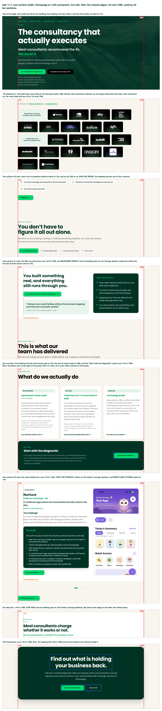
*On a computer: img/11-1.png*

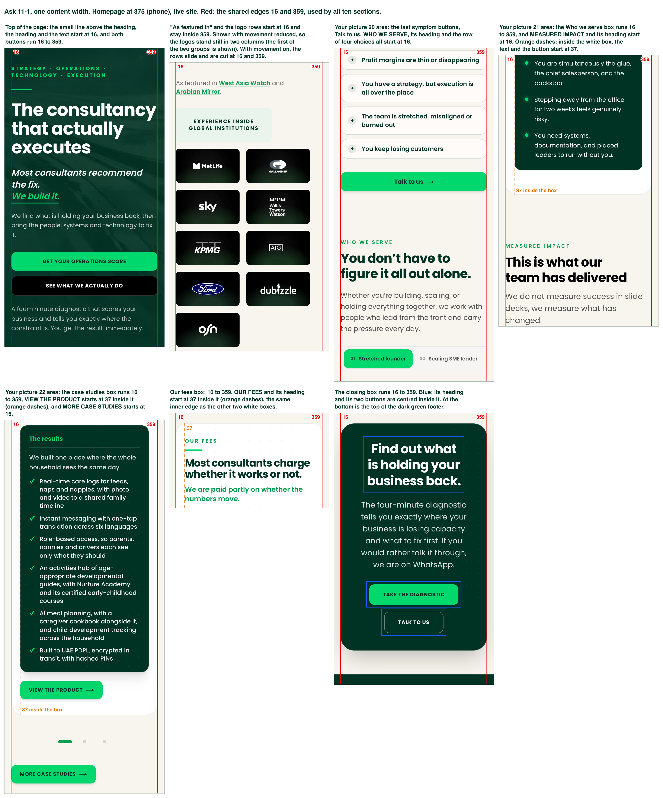
*On a phone: img/11-1-375.png*

### 11.2 · Done with a note

> Use the same spacing between every section

**What was done:** The space between sections is now the same all the way down the homepage, on a computer and on a phone, including the three gaps you marked.

**Note:** The one different gap is just under the large photograph at the top of the homepage, before the "As featured in" line, where the space is a little over half the size of the others.

**Live page:** https://pivotprime.ae/

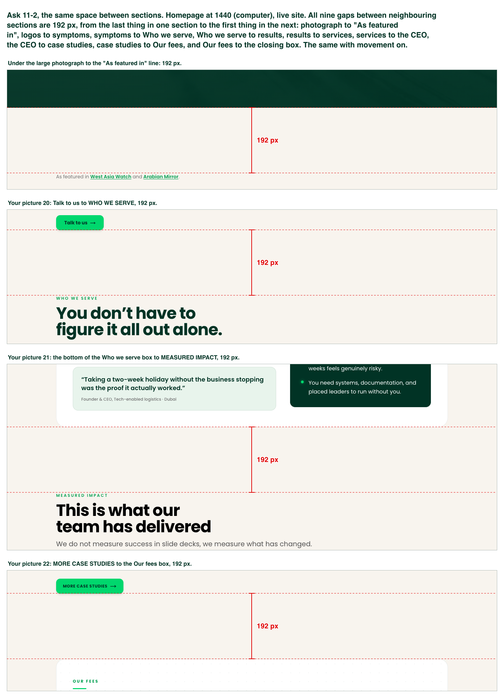
*On a computer: img/11-2.png*

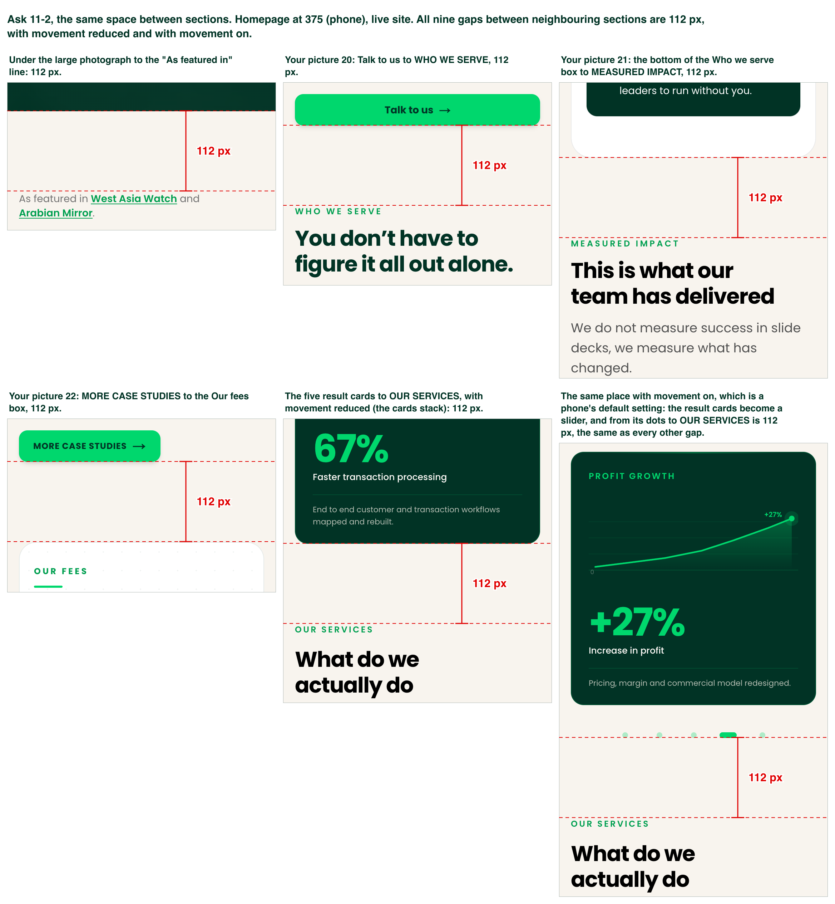
*On a phone: img/11-2-375.png*

### 11.3 · Done

> remove the thin divider line above Who we serve.

**What was done:** The thin line above Who we serve has gone, on a computer and on a phone. Between the "Talk to us" button and Who we serve there is now only the page background, apart from the button's own soft shadow just beneath it, which fades out within about 10 pixels and on a phone runs the full width of the button.

**Live page:** https://pivotprime.ae/

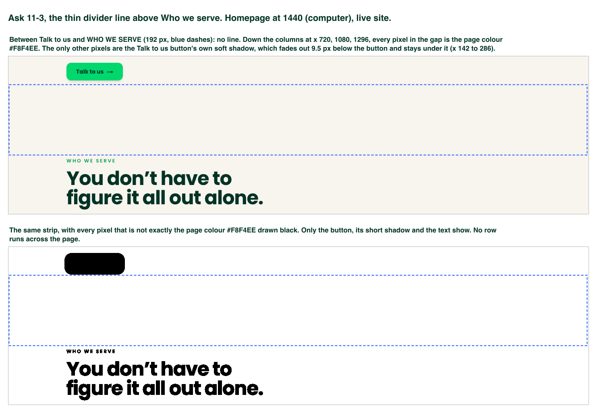
*On a computer: img/11-3.png*

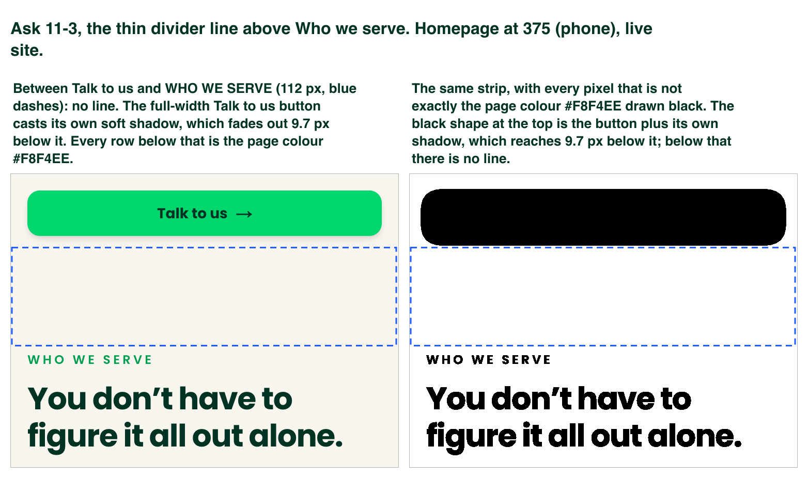
*On a phone: img/11-3-375.png*

### 11.4 · Done with a note

> Use one background colour for boxed sections.

**What was done:** The Who we serve, case studies and Our fees boxes are now all the same pure white, on a computer and on a phone, and the service cards are pure white too.

**Note:** The closing "Find out what is holding your business back." box is still dark green, as before. The smaller cream panels inside sections are also unchanged: the ten buttons in the list of symptoms and the fee calculator panel inside the Our fees box. The Who we serve box keeps a soft shadow that fades out evenly; the case studies and Our fees boxes have none.

**Live page:** https://pivotprime.ae/

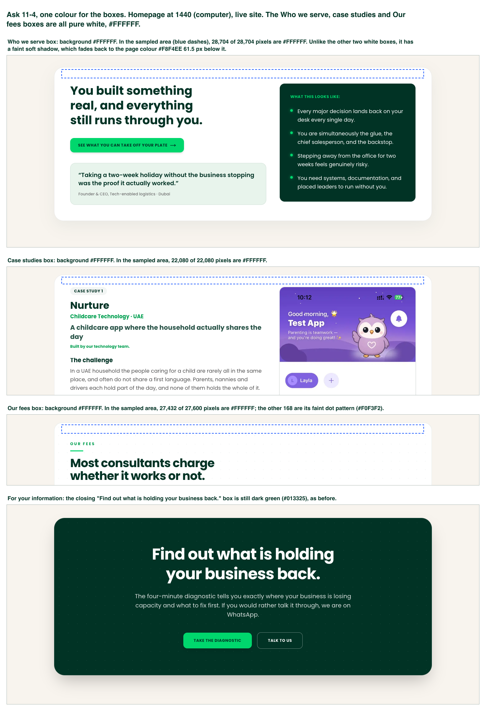
*On a computer: img/11-4.png*

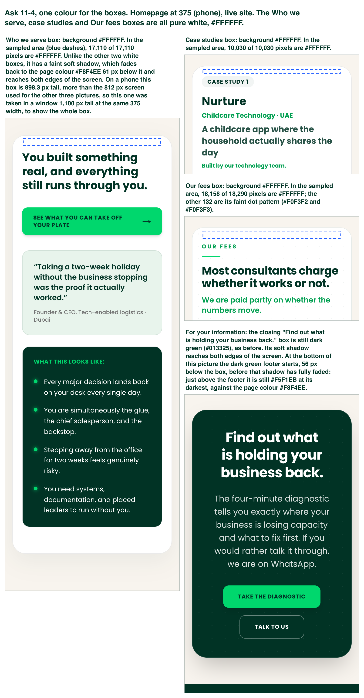
*On a phone: img/11-4-375.png*

### 11.5 · Done

> remove the band.

**What was done:** The grey band under the case studies box has gone. The area under and beside the box now matches the page background on a computer and on a phone, on the homepage and the About page, and the space between sections has not changed.

**Live page:** https://pivotprime.ae/

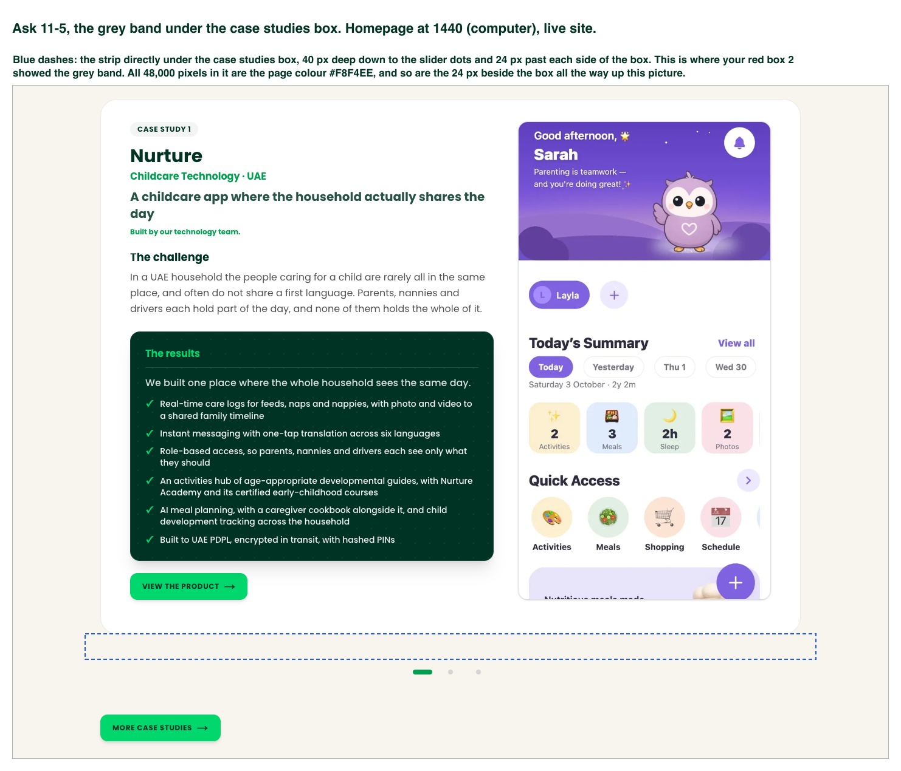
*On a computer: img/11-5.png*

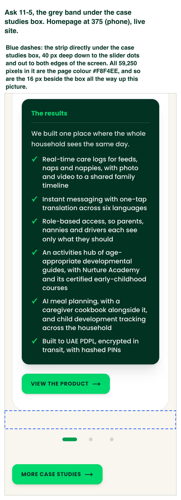
*On a phone: img/11-5-375.png*

## Your earlier comments

Your 23 August and 26 September decks were checked too, to make sure nothing they asked for has been undone. Of the 86 earlier requests that your 30 September deck did not change, 74 are in place, 6 were put right during this check, 3 were changed by your later instructions and 3 are still to do.

### Put right in this check

- **23 August deck, slide 2:** Stop centring the "As featured in" line so it matches the sections below. The "As featured in" line now starts on the same left edge as the headings below it, on a computer and on a phone, instead of sitting in the centre.
- **23 August deck, slide 3:** Change the results line to "we measure what has changed". The line under the results heading now reads exactly "We do not measure success in slide decks, we measure what has changed."
- **23 August deck, slide 14:** Remove the text under the seats diagram. The line of text under the Build and Place seats diagram is gone, so the diagram ends with the six seats on a computer and on a phone.
- **23 August deck, slide 16:** Change the heading to say you are not interested in launching a business in the UAE which will fail. The heading in the Straight answer panel on the UAE Market Entry page reads, word for word, "We are not interested in launching a business in the UAE which will fail."
- **23 August deck, slide 16:** Use your "If after assessment" line under that heading. The line under that heading reads your sentence word for word, starting "If after assessment, we feel your business will fail here", on a computer and on a phone.
- **23 August deck, slide 21:** Follow the About page HTML you emailed. The About page follows your emailed design, and The Bench now shows your five chosen capabilities in green, with the capital M back in "Project Management". The case studies section and team cards follow your later instructions instead, and the other capabilities on The Bench are slightly brighter than in your file.

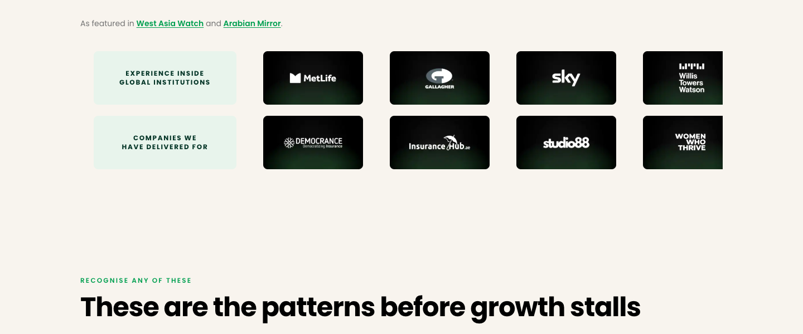
*23 August deck, slide 2: img/r-aug23a-10.png*

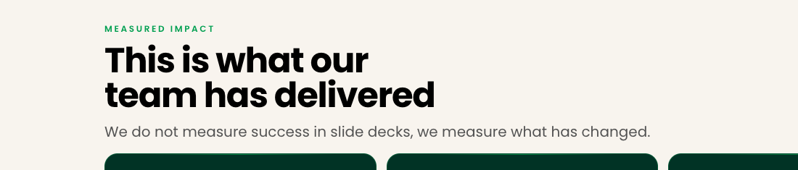
*23 August deck, slide 3: img/r-aug23a-12.png*

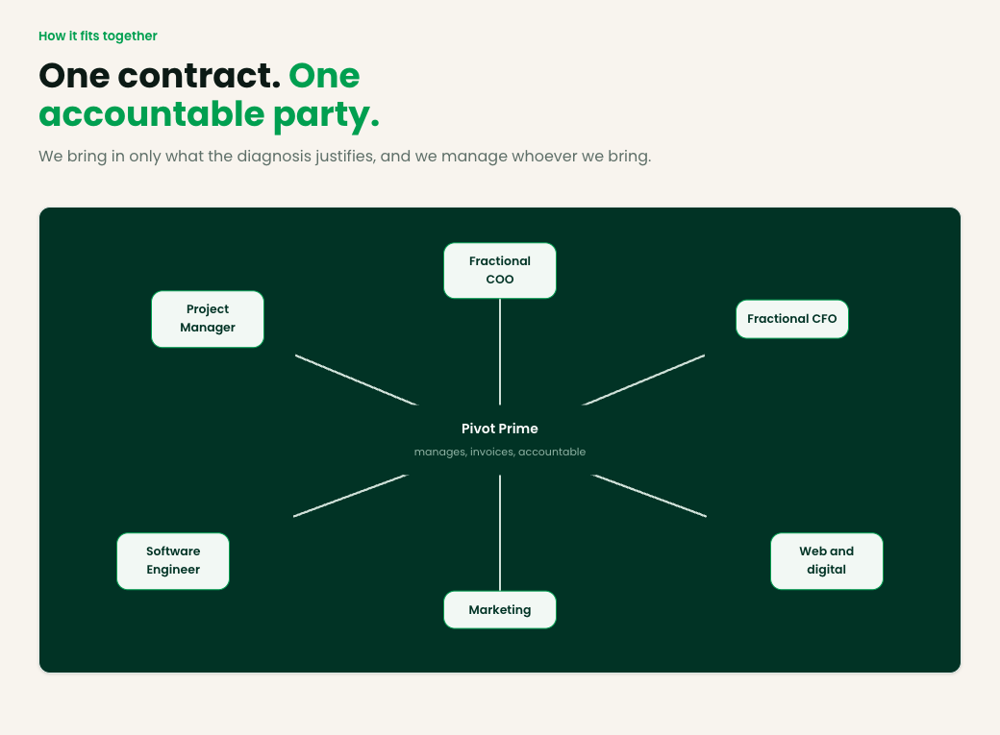
*23 August deck, slide 14: img/r-aug23b-10.png*

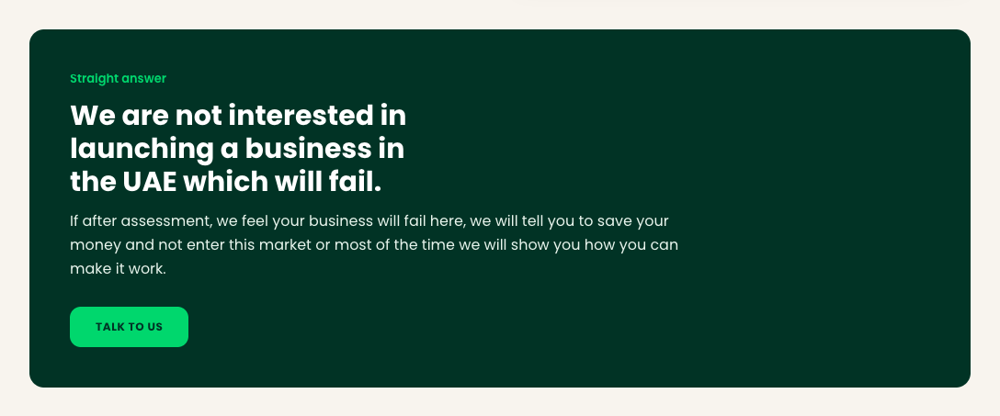
*23 August deck, slide 16: img/r-aug23b-12.png*

*23 August deck, slide 16: img/r-aug23b-13.png*

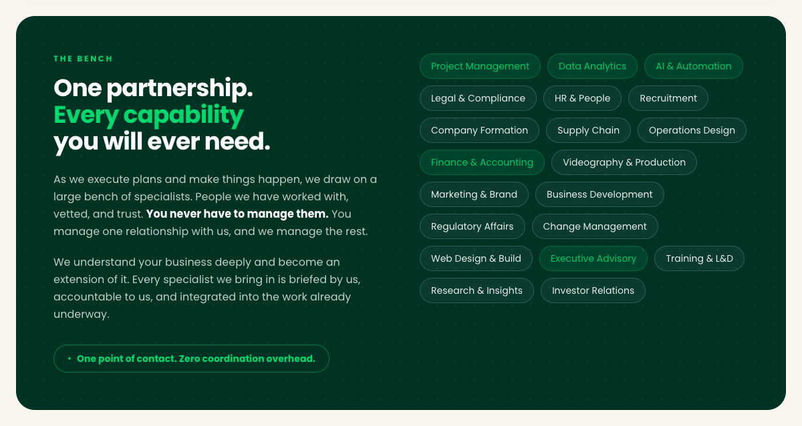
*23 August deck, slide 21: img/r-aug23c-12.png*

### Still to do

- **23 August deck, slide 1:** Use a video at the top of the homepage. The top of the homepage still shows a slowly drifting photograph rather than a video, because no video has been supplied.
- **23 August deck, slide 1:** Reword the second button at the top of the homepage along the lines of "find out what we actually do". That button still reads "SEE WHAT WE ACTUALLY DO" and takes people to the services section, because your note offered more than one possible wording.
- **23 August deck, slide 15:** Keep the top of the Technology Builds page and add a showcase of Saif's work. The top of the Technology Builds page is back, with the green "Builds." and "Own it outright, or we maintain it" beside the price, but there is still no showcase of Saif's work: no project is named and the page has no pictures.

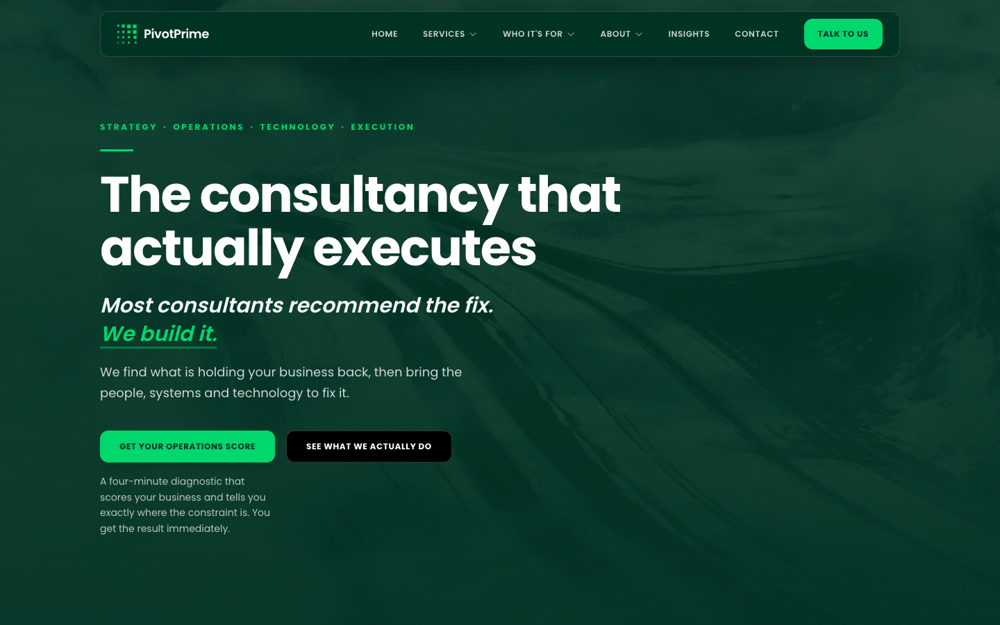
*23 August deck, slide 1: img/r-aug23a-4.png*

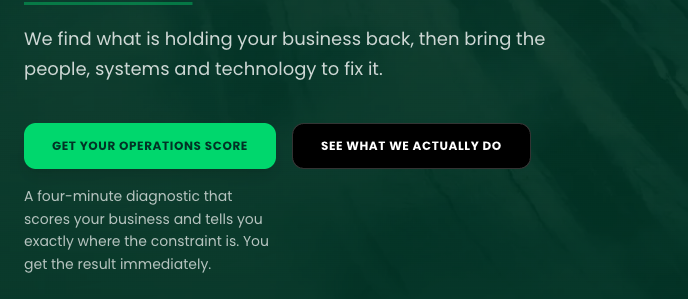
*23 August deck, slide 1: img/r-aug23a-8.png*

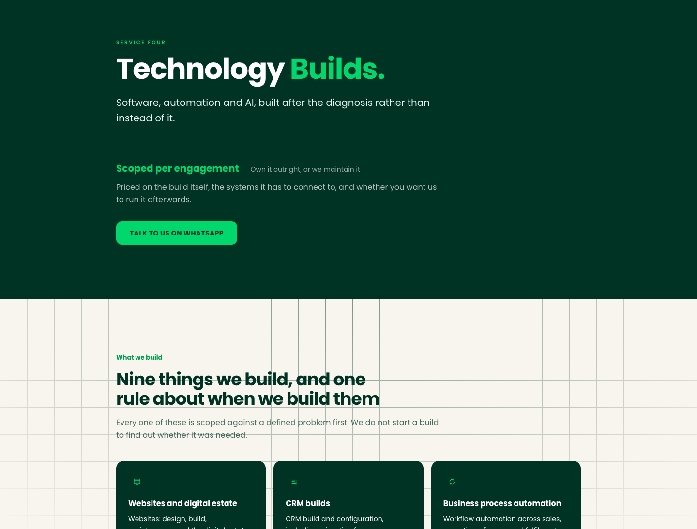
*23 August deck, slide 15: img/r-aug23b-11.png*

### Changed by your later instruction

- **23 August deck, slide 1:** Use the proper Pivot Prime logo. The top bar, the foot of every page and the browser tab all show the logo you confirmed as correct on 1 September. The logo files from your 11 August email were not used.
- **23 August deck, slide 20:** Retitle P&L card 1. P&L card 1 carries your new title and subtitle, with the long dash in the subtitle replaced by a comma, as you later asked for the whole site.
- **23 August deck, slide 20:** Retitle P&L card 3. P&L card 3 carries your new title and subtitle, with the long dash replaced by a comma, as you later asked for the whole site.

### In place

- **26 September deck, slide 1:** Rename the first button at the top of the homepage to "Get your operations score". The first homepage button reads "GET YOUR OPERATIONS SCORE" and takes people to the diagnostic, on a computer and on a phone.
- **26 September deck, slide 1:** Put the grey line under the first button only, not across both. On a computer the grey line sits only under the first button, with the two buttons close together; on a phone the buttons stack and the line sits under both, which was our choice so the pair stays together.
- **26 September deck, slide 1:** Change the grey line to your new diagnostic sentence. The grey line under the two buttons at the top of the homepage reads your sentence word for word, and the old wording is gone.
- **26 September deck, slide 1:** Remove the "Trusted by SMEs" sentence. The "Trusted by SMEs" sentence is gone from the homepage, while the "As featured in" line and both logo rows remain.
- **26 September deck, slide 2:** Reorder the homepage sections to your list. The homepage sections run in your order on a computer and on a phone, and the Our fees section, which your list did not include, has been kept just before the closing box.
- **26 September deck, slide 3:** Make the results cards move on by themselves on a computer. On a computer the results cards move on by themselves every six seconds, even with the mouse resting on them, and the arrows and dots work.
- **26 September deck, slide 3:** Slow the results cards down on a phone. On a phone the results cards change every six seconds instead of every three, and tapping a dot does not stop them.
- **26 September deck, slide 4:** Make all buttons rectangular, including "Take the diagnostic". The "TAKE THE DIAGNOSTIC" button, on the homepage and the Services page, and every other button on the homepage have the same small rounded corners as your example, and only the ten buttons in the list of symptoms are a little rounder, though still not pill-shaped.
- **26 September deck, slide 5:** Move the patterns section higher up the homepage. The patterns section is the third section on the homepage, straight after the logos.
- **26 September deck, slide 5:** Put the green "Select the symptoms" bar first, under the big heading. The green "Select the symptoms" bar sits straight under the heading and above all ten symptoms, and choosing symptoms updates it and carries them into the contact form.
- **26 September deck, slide 5:** Change the bar wording to tell people to tap any blockers below. The bar reads "Select the symptoms that sound familiar", then "Tap any blockers below to see how we structure the fix", with "below" in lower case because it falls mid-sentence.
- **26 September deck, slide 8:** Put the results before the "View the product" links. On the homepage and the About page, the results come before the "View the product" and "Visit the site" buttons on the Nurture, Cinnacare and Scentmatic case studies.
- **26 September deck, slide 9:** Fix the size of the closing box and its heading. The closing box is the same width as the rest of the page, and its heading is now the same size as the other main section headings.
- **26 September deck, slide 9:** Change the closing heading to "Find out what is holding your business back". The closing heading reads "Find out what is holding your business back."
- **26 September deck, slide 9:** Change the closing subtext to your diagnostic and WhatsApp sentence. The line under the closing heading reads your sentence word for word, and the old "Two ways to start" text is gone.
- **26 September deck, slide 9:** Label the closing buttons "Take the diagnostic" and "Talk to us". The closing buttons read "TAKE THE DIAGNOSTIC" and "TALK TO US", and open the diagnostic and WhatsApp.
- **26 September deck, slide 10:** Remove Build and Place and UAE Market Entry from the Services menu. The Services menu lists only "All Services", "Operational Clarity Audit", "Fractional Leadership" and "Technology Builds", on a computer and on a phone.
- **26 September deck, slide 10:** Keep those two pages live for search and direct visits. The Build and Place and UAE Market Entry pages are still live, open directly and remain listed for search engines.
- **26 September deck, slide 10:** Link to those two pages from other pages. The Operational Clarity Audit page links to UAE Market Entry, and the Fractional Leadership page links to Build and Place. Build and Place is also linked from the service buttons on the For Founders and For Corporate Innovators pages. The Services page no longer links to either, because it shows just your three offers.
- **26 September deck, slide 11:** Add the UAE Market Entry section to the audit page. The UAE Market Entry section sits after "How we do it" and "What happens after" on the audit page, with your wording and a working link, though its heading is not in capitals, in line with your earlier rule for headings on the service pages.
- **26 September deck, slide 12:** Add the "Need other staff" section to the Fractional Leadership page. Your heading and paragraph are on the Fractional Leadership page word for word, straight after "Where it does not fit" and "How it runs", with only the first letter of the heading in capitals, like its neighbours, rather than all in capitals as you typed it.
- **26 September deck, slide 12:** Add a "Find out more about Build and Place" link. The "Find out more about Build and Place" button sits in that section, opens that service's page and has the site's small rounded corners.
- **26 September deck, slide 13:** Capitalise the Who it's for menu items. The Who it's for menu reads "For Founders", "For SMEs", "For Corporate Innovators" and "For P&L owners" on a computer and on a phone, and all four pages open.
- **26 September deck, slide 14:** Remove the long dashes from the articles and the whole site. There are no long dashes anywhere on the live site, including the articles and every diagnostic screen. The only dashes left are short ones in seven number ranges, such as ranges of months or weeks, kept on purpose.
- **26 September deck, slide 14:** Reword the sentence in the "consultant leaves" article. The "consultant leaves" article reads "Building these things requires someone in the room, not quarterly, not monthly", with your commas in place of the dash.
- **26 September deck, slide 15:** Change "Book a call with Iram" to just "Book a call". Where an article offers a call, its closing button now says just "Book a call" and opens the contact page, and "Book a call with Iram" appears nowhere on the site.
- **26 September deck, slide 15:** Match the article button's corners to the rest of the site. The closing buttons on all seven articles have the same small rounded corners as the homepage button you showed, not a pill shape.
- **26 September deck, slide 16:** Spell check all the articles. A British English spell check of all seven live articles and the Insights page found no spelling mistakes.
- **26 September deck, slide 16:** Fix the first sentence of the decisions article. The first sentence of the decisions article shows P&L correctly, with "organisation" spelt the British way with an s, as on the rest of the site, rather than with the z you typed.
- **26 September deck, slide 18:** Show only the blurred results and the form before people unlock them. After the last question the diagnostic shows only the blurred score, the blurred area breakdown and the details form. Its heading reads "Unlock your score and get the full report" and its button reads "Unlock my score", rather than the wording in your picture.
- **26 September deck, slide 18:** Make the diagnostic buttons rectangular. Every button in the diagnostic, including "Start the diagnostic", "Next", "See my results" and "Unlock my score", has the site's small rounded corners, and "Back" is plain text with no box.
- **26 September deck, slide 22:** Make the Insights closing button rectangular. The button in the Insights closing box has the site's small rounded corners, not a pill shape.
- **26 September deck, slide 22:** Make the Insights button just say "Book a call". The Insights closing button says just "Book a call" and opens the contact page.
- **23 August deck, slide 1:** Try the top bar in different colours to compare. The top bar was set to one solid dark green on 27 August, and our August review of your comments records the colour trial as done. It is that same dark green on a computer and on a phone.
- **23 August deck, slide 1:** Give the top bar small rounded corners so it is more rectangular. The top bar has small rounded corners and reads as a rectangle on a computer and on a phone, including with the phone menu open.
- **23 August deck, slide 1:** Put Strategy, Operations, Technology, Execution at the top. The line above the headline names Strategy, Operations, Technology and Execution in your order, on one line on a computer and on two lines on a phone.
- **23 August deck, slide 1:** Set the "Most consultants" line apart with a different font or italics. The "Most consultants recommend the fix" line and the green, underlined line after it are both in italics, so they stand apart from the heading and paragraph around them.
- **23 August deck, slide 1:** Cut the paragraph at the top of the homepage down to the sentence about finding what is holding your business back. The paragraph under the headline is now only that sentence, and it begins "We find what is holding", without the word "out" from your note.
- **23 August deck, slide 2:** Improve the logo rows with proper logos. The logo rows use proper logo files, with the two group names shown as plain text tiles, and the two rows scroll in opposite directions. The older tiles carry a faint green glow at their foot and the seven newest are plain, and the Ford and Nurture logos keep their own colours.
- **23 August deck, slide 3:** Give each results figure its own visual style. Each of the five results cards has its own drawing, so no two look alike, and the old rotating ring chart is gone.
- **23 August deck, slide 3:** Try warmer colour options, using the ivory instead of cold white. The pages sit on a warm cream instead of cold white, mixed from your ivory and linen rather than the ivory alone, with no gold or tan. White is used only inside boxes and cards, such as those described under 11.4, never for a whole section.
- **23 August deck, slide 3:** Make the results cards from the HTML you sent. The five results cards follow your HTML file with your figures and drawings, one reads "Increase in profit" rather than your picture's "Increase in profit margin", and the short line under each figure is back because your file includes it.
- **23 August deck, slide 6:** Remove the "Knowing what is wrong is hard" section. The "Knowing what is wrong is hard" section and its four step cards are gone from the homepage.
- **23 August deck, slide 8:** Replace "Chapter 2" with "Case studies". The section is headed "CASE STUDIES", and no chapter number appears on any of the main pages.
- **23 August deck, slide 8:** Use the photos you emailed for case studies 1 and 2. Cinnacare shows your photo of the two baby oil bottles and Scentmatic shows the vending machine on the bar, on the homepage and the About page, both fully in frame.
- **23 August deck, slide 8:** Use your new quote in the case studies section. Your quote appears in the case studies section word for word, credited to you as "Founder and CEO", with a straight apostrophe rather than a curly one in "it's".
- **23 August deck, slide 8:** Move the anonymised case studies to About and add a "More case studies" button. The homepage shows only Nurture, Cinnacare and Scentmatic, and a "MORE CASE STUDIES" button, on the same left edge as the headings, takes people to the case studies on the About page.
- **23 August deck, slide 8:** Use your text for the second anonymised case study. The Founder-led business case study on the About page uses your text word for word.
- **23 August deck, slide 8:** Use your text for the third anonymised case study. The Fitness and wellness case study on the About page uses your text word for word.
- **23 August deck, slide 8:** Show at least one of Saif's projects as a case study. Saif's Nurture app is the first case study on the homepage and the About page, with a note that our technology team made it.
- **23 August deck, slide 8:** Keep the anonymised case studies only on About, with a link to them. The anonymised case studies appear only on the About page, and the homepage links to them.
- **23 August deck, slide 9:** Head the section "WHO WE SERVE", with no chapter number. The section is headed "WHO WE SERVE", with no chapter number.
- **23 August deck, slide 9:** Order the readers: founder, SME, corporate innovator, then the mid-market owner. The Who we serve tabs and the Who it's for menu run founder, SME, corporate innovator, then P&L owner, with the founder tab open first.
- **23 August deck, slide 9:** Rename the mid-market reader to "P&L owner". The mid-market reader is now called "P&L owner" on the homepage, in the menu and on its own page, and the old mid-market wording is gone.
- **23 August deck, slide 9:** Change Riyadh to Qatar in the corporate innovator quote. The corporate innovator quote is credited to a regional retail group in Qatar, and Riyadh appears on none of the main pages.
- **23 August deck, slide 9:** Put the quote boxes in the lighter green. The quote boxes on all four Who we serve tabs are light green on a white panel.
- **23 August deck, slide 10:** Change the fees label to just "OUR FEES". The fees section label reads "OUR FEES", with no chapter number, on a computer and on a phone.
- **23 August deck, slide 10:** Use larger quote boxes in the fees section. The small fees tag has been replaced by one large, full-width dark green box headed "Performance linked fees", though there is one box rather than several and its sentence is at normal text size rather than headline size as in your fees pictures.
- **23 August deck, slide 12:** Show a "What you get" panel with a shaded right side on every service page. Every service page has a two-box panel with a plain white left side and a dark green right side, though only the audit page's panel is headed "What you get".
- **23 August deck, slide 13:** Rename Fractional COO to Fractional Leadership in the menu. The Services menu says "Fractional Leadership", and the old Fractional COO link still works and leads to that page, while the service card on the homepage and Services page still reads "Fractional COO, CFO and Chief of Staff", which you did not ask to change.
- **23 August deck, slide 13:** Use your revised graphic on the Fractional Leadership page. The Fractional Leadership page shows the three phase cards from your 22 August service pages file in place of the old curve, with no monthly cost line.
- **23 August deck, slide 14:** Remove "Watch the seats fill". "Watch the seats fill" is gone from the Build and Place page.
- **23 August deck, slide 14:** Add Fractional COO to the seats diagram. Fractional COO appears on the Build and Place diagram as a sixth seat, and nothing overlaps on a computer or on a phone.
- **23 August deck, slide 14:** Write "Project Manager" with a capital M. The seat reads "Project Manager" with a capital M.
- **23 August deck, slide 14:** Change "Engineer" to "Software Engineer". The seat reads "Software Engineer" instead of "Engineer".
- **23 August deck, slide 17:** Hide the How We Work page but keep its wording. The How We Work page is still hidden, off the menus and out of search listings, and its wording is saved. The one exception is your green line under its heading, "It's about doing what works", which was replaced by a line we wrote before the page was hidden; your original line is kept only in our records.
- **23 August deck, slide 18:** Change the eyebrow heading to "FOR FOUNDERS". The small heading on the For Founders page reads "FOR FOUNDERS" with no chapter number, and the other three reader pages follow the same pattern, with the corporate page reading "FOR CORPORATE LEADERS" while its menu label says "For Corporate Innovators".
- **23 August deck, slide 18:** Keep only the heading, subheading and box on each For Founders card. Each For Founders card shows only its heading, its green line and its box, plus the service button added later.
- **23 August deck, slide 18:** Do the same on the For SMEs page. Each For SMEs card is cut back to its heading, green line and box, plus its service button, the same as For Founders.
- **23 August deck, slide 19:** Title the last corporate card "Senior judgment, on call". The last corporate card is titled "Senior judgment, on call", exactly as you wrote it.
- **23 August deck, slide 19:** Use your new subtitle on the last corporate card. The green line under that card reads your words exactly, starting "Through Fractional Leadership Services."
- **23 August deck, slide 19:** Put your monthly or ad hoc wording in the side box. The side box on that card says the typical engagement is monthly or ad hoc and that it is like having an Executive Board you can consult when you need.
- **23 August deck, slide 20:** Use P&L owners on the homepage too. The homepage calls the fourth reader "P&L owner", in the singular like the other three tabs, the menu says "For P&L owners", and the old mid-market wording is gone from every page.
- **23 August deck, slide 20:** Retitle P&L card 2. P&L card 2 carries your new title and subtitle word for word.

## Still open, and what each needs

- **Slide 6:** A screenshot of the live Nurture app's home screen, the same screen as now, showing a real-looking name in place of "Test App", taken from a demo account, because a real family's name and details should not appear on a public website. It is needed from you or Saif, taken on a phone in the same tall shape, and it will simply replace the current picture on the same card.
- **Slide 9:** Needed from you or Saif: a way of emailing subscribers when a new article is published; the addresses of the people who have signed up so far, gathered from any sign-up notices in the hello@pivotprime.ae inbox; and a decision on whether the three September articles should now be sent to them. The test can then be run on the next article.
- **23 August deck, slide 1:** From you: a video for the top of the homepage, which you have the rights to use.
- **23 August deck, slide 1:** The exact words for the second button at the top of the homepage, from you. Until then it keeps "SEE WHAT WE ACTUALLY DO".
- **23 August deck, slide 15:** From Saif: the list of projects to show, a screenshot or picture of each with client details blurred, and which client names can be shown. His profile on the About page already names four of his projects, but there are no pictures yet.
